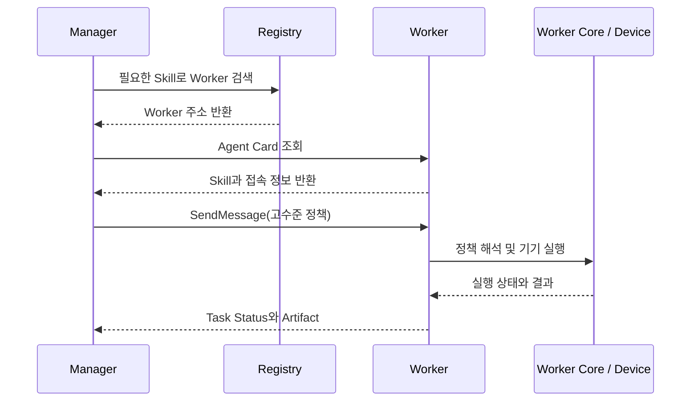

# AI-Care Edge System: A2A 핵심 인수인계

> 목적: 다른 AI가 지금까지의 A2A 논의와 AI-Care 적용 방향을 빠르게 이해하도록 핵심만 정리한다.
>
> 기준: A2A 공식 명세 1.0.0과 현재 프로젝트 논의.

## 1. A2A 핵심 개념과 AI-Care 대응 관계

**Agent2Agent Protocol(A2A)**은 서로 독립적으로 구현된 AI Agent가 상대의 능력을 확인하고, 작업을 요청하며, 진행 상태와 결과를 공통 형식으로 교환하기 위한 통신 표준이다.

AI-Care에서는 다음 구간에 A2A를 적용한다.

- 우선 적용: `Manager AI Agent ↔ Worker AI Agent`
- 향후 확장: `Worker AI Agent ↔ Worker AI Agent`

| A2A 개념 | 역할 | AI-Care 대응 |
|---|---|---|
| Client Agent | 다른 Agent를 찾고 작업을 요청 | Manager AI Agent |
| Remote Agent | 능력을 공개하고 요청받은 작업을 수행 | Worker AI Agent |
| Agent Card | Agent의 접속 정보와 능력을 설명 | Worker의 디지털 명함 |
| Skill | 외부에 공개하는 고수준 능력 | 냉장고 온도 조절, TV 전원 제어 등 |
| Message | 요청 또는 응답을 전달 | 고수준 정책 전달 |
| Task | 상태를 추적하는 작업 | IoT 기기 제어 작업 |
| Artifact | 작업을 통해 생성된 결과 | 실행 성공 여부, 최종 관측값 등 |

반드시 유지할 경계는 다음과 같다.

- A2A는 중앙 제어 AI가 아니다. Manager는 AI-Care가 별도로 설계한다.
- A2A는 Worker를 자동으로 선택하지 않는다. 선택 기준과 로직은 Manager의 책임이다.
- A2A는 IoT 기기 내부 제어를 대신하지 않는다. 실제 제어에는 기기 API, ROS2, MQTT 등이 필요하다.
- A2A는 전달 형식과 상호작용을 정의한다. 전달할 정책의 의미는 AI-Care가 정의한다.

## 2. 핵심 객체

### Agent Card와 Skill

`Agent Card`는 Worker가 공개하는 JSON 문서다. Manager는 여기에서 Worker의 이름, 접속 주소, 지원 통신 방식, 제공하는 `Skill`을 확인한다.

`Skill`은 내부 함수 목록이 아니라 Manager가 작업을 맡길 때 이해할 수 있는 고수준 능력이다.

예시:

- Refrigerator Worker: `temperature-control`, `temperature-check`
- Smart TV Worker: `power-control`, `volume-control`
- Medication Dispenser Worker: `schedule-check`, `medication-dispense`

```text
Skill: 냉장고 온도 조절
→ Worker 내부 Action: 현재 온도 확인, 목표 온도 설정, 결과 확인
→ Device Adapter: 실제 기기 제어 API 호출
```

### Message, Task, Artifact

| 객체 | 의미 | AI-Care 사용 방식 |
|---|---|---|
| Message | 요청·응답 한 번의 기본 단위 | 고수준 정책을 Structured Data로 전달 |
| Task | 상태와 수명주기를 가진 작업 | `submitted → working → completed/failed` 추적 |
| Artifact | Task 수행으로 생성된 결과물 | 성공 여부, 최종 온도, 목표 달성 여부 반환 |

간단한 요청은 Message로 바로 응답할 수 있으므로 모든 Message가 반드시 Task와 Artifact로 이어지는 것은 아니다. IoT 제어처럼 실행 시간이 걸리고 상태 확인이 필요한 요청은 Task로 관리하는 것이 적합하다.

### A2A 구조와 AI-Care 정책의 구분

AI-Care 고수준 정책은 A2A Message의 Structured Data 부분에 담는다.

```json
{
  "skillId": "refrigerator.temperature-control",
  "targetDevice": "refrigerator-01",
  "parameters": { "temperature": 3 }
}
```

- A2A가 정의: Message, Part, Task, Artifact, SendMessage 등의 외부 구조
- AI-Care가 정의: `skillId`, `targetDevice`, `parameters`의 의미와 기기별 제약

즉, **A2A는 정책을 전달하는 규격이고 AI-Care Policy Schema는 전달할 내용의 규격이다.**

## 3. 통신 시퀀스



구현 순서는 다음과 같다.

1. Manager가 사용자 의도를 목표와 고수준 정책으로 변환한다.
2. 필요한 Skill을 기준으로 Registry 또는 고정 설정에서 Worker 후보를 찾는다.
3. Worker의 Agent Card를 조회해 Skill과 접속 정보를 확인한다.
4. Manager의 A2A Client가 `SendMessage`로 정책을 전달한다.
5. Worker의 A2A Server와 Agent Executor가 정책을 Worker AI Core로 넘긴다.
6. Worker AI Core가 정책을 저수준 명령으로 변환해 기기를 실행한다.
7. Worker Analyzer가 실행 상태를 Task Status로, 최종 결과를 Artifact로 변환해 Manager에 반환한다.
8. 실패한 경우 Manager는 정책 수정이나 다른 Worker 선택을 수행할 수 있다.

초기에는 Worker 주소를 고정해도 된다. Worker 수가 증가하면 `Edge AI Management System`을 Agent Registry로 사용한다. Registry는 후보를 제공하지만 최종 Worker 선택은 Manager가 수행한다.

## 4. 개발해야 할 컴포넌트

| 위치 | 컴포넌트 | 책임 |
|---|---|---|
| Manager AI Agent | A2A Client | Agent Card 조회, Message 전송, Task 상태와 결과 수신 |
| Manager AI Agent | Discovery / Worker Selector | 필요한 Skill을 제공하는 Worker 검색·선택 |
| Edge AI Management System | Agent Registry | Worker 주소와 Skill 정보 관리 |
| Worker AI Agent | Agent Card | Worker의 접속 정보와 Skill 공개 |
| Worker AI Agent | A2A Server | A2A 요청 수신과 응답 |
| Worker AI Agent | Agent Executor | Message에서 정책을 꺼내 Worker AI Core에 전달 |
| Worker AI Core | Policy Handler | Skill과 parameters를 해석해 실행 경로 결정 |
| Worker 내부 | Device Adapter | 정책을 기기 API, ROS2, MQTT 명령으로 변환 |
| Worker AI Analyzer | Task / Artifact 변환 로직 | 내부 실행 상태와 결과를 A2A 객체로 변환 |

핵심 내부 연결은 다음과 같다.

```text
A2A Message 수신
→ Agent Executor
→ Policy Handler
→ Perception / Reasoning / Action
→ Device Adapter
→ Task Status / Artifact 반환
```

A2A Server만 만든다고 기기가 자동으로 실행되는 것은 아니다. A2A 통신 계층과 기존 Worker 실행 로직을 연결하는 `Agent Executor`, `Policy Handler`, `Device Adapter`가 필요하다.

## 5. 관련 논문이 제공하는 근거와 고려사항

관련 논문:

> Qiang Duan, Zhihui Lu, “Agent Communications toward Agentic AI at Edge — A Case Study of the Agent2Agent Protocol,” 2025, arXiv:2508.15819. DOI: 10.48550/arXiv.2508.15819.

### 구현 가능성의 근거

- 논문의 MAS 구조는 실제 작업을 수행하는 Agent 계층과 Agent Communication Layer를 분리한다.
- AI-Care의 Manager와 Worker는 이 Agent 계층에, 두 Agent 사이의 정책·상태·결과 전달은 통신 계층에 대응한다.
- 논문이 설명한 Client Agent–Remote Agent와 Agent Card 기반 상호작용은 AI-Care의 Manager–Worker 구조와 유사하다.
- 따라서 A2A를 AI-Care의 Agent 간 통신 계층으로 구현하는 것은 구조적으로 가능하다는 근거가 된다.

단, 이 논문은 A2A가 Edge 환경에서 우수한 성능을 낸다는 것을 실험으로 증명한 연구는 아니다. 구조적 적용 가능성과 예상 문제를 분석한 사례 연구로 해석해야 한다.

### 구현·실험에서 확인할 고려사항

- Agent Card만으로 CPU, Memory, Bandwidth 같은 현재 자원 상태를 충분히 반영하기 어려울 수 있다.
- Worker 수가 증가하면 Registry 검색과 Point-to-Point 통신이 병목이 될 수 있다.
- A2A의 메시지 및 Task 관리가 Custom REST API보다 통신량과 처리 비용을 늘릴 수 있다.

이 문제들이 실제 AI-Care 환경에서도 발생하는지는 직접 구현한 뒤 지연시간, 전송 데이터량, 처리량, 실패율을 측정해 확인해야 한다.

## 6. 확정 방향과 미확정 사항

### 확정한 방향

- A2A의 우선 적용 범위는 Manager–Worker 간 외부 통신이다.
- Manager는 A2A Client, Worker는 A2A Server 역할을 맡는다.
- Worker는 Agent Card와 Skill로 자신의 능력을 공개한다.
- 고수준 정책은 A2A Message의 Structured Data에 담는다.
- 실행 과정은 Task Status로 추적하고 최종 결과는 Artifact로 반환한다.
- Worker 내부에 Agent Executor, Policy Handler, Device Adapter를 연결한다.
- 첫 PoC는 Manager 1개, Worker 1개, Skill 1개로 전체 왕복을 확인한다.

### 아직 결정하지 않은 사항

- 사용할 A2A SDK와 구현 언어
- 최종 AI-Care Policy JSON Schema
- Registry 데이터 모델과 검색 API
- Worker 선택 알고리즘
- Task 상태 전달 방식: Polling, Streaming, Push
- 사용할 Binding: HTTP+JSON/REST, JSON-RPC, gRPC
- Worker–Worker 협력 시나리오
- 실제 Edge 환경에서의 성능과 Custom REST API 대비 비용

## 참고 자료

- [A2A Protocol Specification 1.0.0](https://a2a-protocol.org/latest/specification/)
- [A2A Agent Discovery](https://a2a-protocol.org/latest/topics/agent-discovery/)
- [Duan and Lu, 2025, arXiv:2508.15819](https://arxiv.org/abs/2508.15819)
