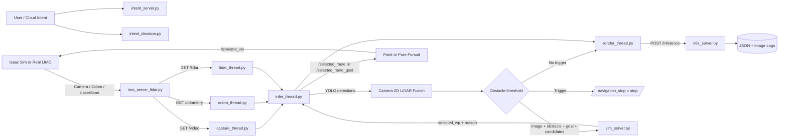
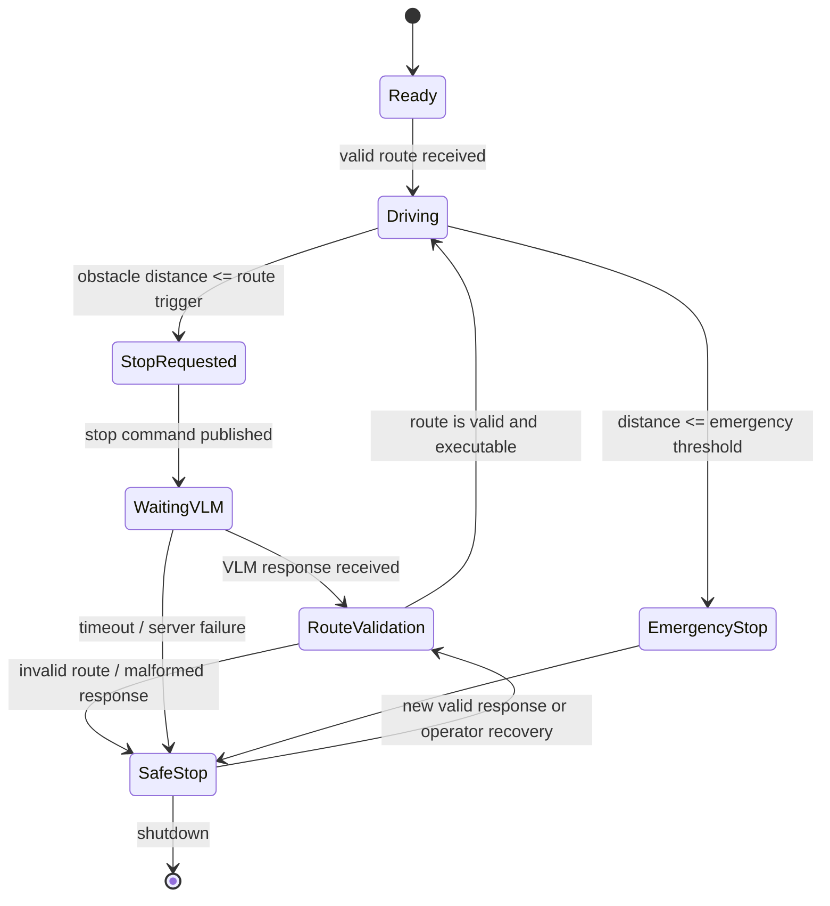

# I2ICF 기반 ViLaR-IMO 프로젝트 컨텍스트 및 LLM 통합 명세서

> **프로젝트 저장소:** [SDV_Robocar](https://github.com/cowltnr/SDV_Robocar)  
> **기준 브랜치:** [ICTC2026](https://github.com/cowltnr/SDV_Robocar/tree/ICTC2026)  
> **작성 기준일:** 2026-08-05  
> **프로젝트 명칭:** **ViLaR-IMO: Vision–Language Route Selection with Camera–2D LiDAR Fusion for Indoor Robots**

---

## 1. 문서 목적과 활용 방식

이 문서는 `SDV_Robocar` 프로젝트의 연구 배경, I2ICF 연계 의미, 시스템 구성, 코드별 역할, 실행 순서, ROS2/HTTP 인터페이스, 핵심 알고리즘, 실험 결과, 안전 제약, 알려진 한계와 후속 확장 방향을 구조화하여 제공하는 프로젝트 컨텍스트 문서이다. 여러 프로젝트의 Markdown 문서를 함께 수집하는 LLM/RAG 생태계에서 ViLaR-IMO의 기능, 인터페이스, 제약, 근거 자료와 다른 프로젝트와의 연결 지점을 정확히 검색·해석할 수 있도록 하는 것이 목적이다.

LLM/RAG 시스템 또는 다른 프로젝트가 이 문서를 참조할 때는 다음 순서로 정보를 해석하는 것을 권장한다.

1. **2장**에서 프로젝트 목적과 I2ICF 연계 구조를 이해한다.
2. **3장**에서 전체 데이터·제어 흐름을 확인한다.
3. **4장**에서 담당할 코드 파일과 연결 모듈을 찾는다.
4. **5~7장**에서 데이터 계약, 알고리즘, 실행 방법을 확인한다.
5. **8~11장**에서 검증 결과, 한계, 안전 규칙, 추가 문서화 항목을 확인한다.

### 1.1 문서의 근거와 검증 수준

이 문서는 다음 자료를 기준으로 작성하였다.

- GitHub `ICTC2026` 브랜치의 `README.md`와 공개된 저장소 구조
- ViLaR-IMO 논문 원고의 시스템 설계, 알고리즘, 실험 설정 및 결과
- 기존 I2ICF 기반 IMO 프로젝트 발표 자료의 robot–edge–cloud 구조
- 프로젝트에서 사용한 실험 표·그림과 운영 과정에서 확인된 주의사항

각 코드 파일의 **역할과 인터페이스는 저장소 `README.md`에 명시된 내용을 우선** 사용하였다. 함수 단위 세부 동작, 예외 처리, 기본값, 패키지 메타데이터는 실제 소스의 최신 commit을 추가 검토하여 확정해야 한다. LLM 생태계에 등록하거나 다른 프로젝트에서 참조하기 전에 이 문서에 기준 commit SHA를 기록하는 것을 권장한다.

---

## 2. 프로젝트 개요

### 2.1 해결하려는 문제

실내 이동 로봇이 사용자 의도를 수행하려면 단순히 목적지로 이동하는 것만으로는 부족하다. 로봇은 다음 기능을 연결된 폐루프로 수행해야 한다.

1. Camera, 2D LiDAR, odometry로 환경과 자기 상태를 관측한다.
2. 영상에서 객체의 의미 class와 위치를 탐지한다.
3. Camera–2D LiDAR fusion으로 탐지 객체의 metric distance를 계산한다.
4. 현재 경로가 장애물로 인해 실행하기 어려운지 판단한다.
5. 로봇을 우선 정지시킨 뒤 VLM에 대안 경로 선택을 요청한다.
6. VLM이 반환한 유효한 waypoint route를 deterministic follower가 실행한다.
7. perception, decision, route, execution 결과를 cloud/logging server에 저장한다.

ViLaR-IMO는 이 과정을 **sensing/perception → decision/VLM reasoning → control/shared update**로 연결한 연구용 indoor navigation framework이다.

### 2.2 핵심 구성 요소

- **Robot/IMO:** AgileX LIMO 또는 Isaac Sim의 LIMO ROS2 모델
- **Sensors:** RGB camera, 2D LiDAR, odometry
- **Perception:** YOLOv8s object detection
- **Fusion:** training-free geometric Camera–2D LiDAR late fusion
- **Decision:** obstacle threshold와 intent feasibility 기반 stop/route-selection trigger
- **VLM:** `qwen2.5vl:3b` via Ollama를 이용한 high-level candidate route selection
- **Control:** Point Follower 또는 Pure Pursuit Follower
- **Communication:** ROS2 topics + Flask/REST APIs
- **Shared update:** image/JSON log 저장과 다른 IMO 또는 관리 시스템을 위한 상태 공유

### 2.3 현재 구현 범위

현재 공개 브랜치가 설명하는 주요 구현 범위는 다음과 같다.

- Isaac Sim/ROS2 sensor topic을 Flask endpoint로 제공
- edge side에서 camera, odometry, LiDAR stream 병렬 수집
- YOLO detection과 person bounding box 기반 LiDAR distance estimation
- 4.0 m 이내에서 route selection trigger, 1.2 m 이내에서 emergency stop 판단
- VLM에 image, goal, fused obstacle, candidate routes 전달
- `wp1`~`wp5` 중 유효한 route를 선택하여 ROS2에 publish
- Point Follower 또는 Pure Pursuit로 `/sim/cmd_vel` 생성
- inference image와 structured JSON을 logging server에 저장

현재 시스템은 **VLM이 low-level control 값을 직접 생성하지 않는다.** VLM은 미리 정의되고 goal-feasible한 후보 route 중 하나를 선택하며, 실제 속도 명령은 deterministic controller가 생성한다.

---

## 3. I2ICF Framework와의 연계

### 3.1 I2ICF 관점의 프로젝트 위치

I2ICF는 사용자 intent를 기반으로 in-network computing function을 구성·관리·모니터링하기 위한 interface framework이다. 이 프로젝트는 I2ICF 개념을 indoor Intelligent Moving Object에 적용한 연구 prototype으로 볼 수 있다.

ViLaR-IMO의 주요 모듈을 I2ICF 관점에 대응시키면 다음과 같다.

| I2ICF/IMO 역할 | 프로젝트 구성 요소 | 수행 기능 |
|---|---|---|
| User intent input | `intent_server.py`, `/user_intent_goal`, policy YAML | 사용자 목적 또는 high-level policy 수신 |
| Policy/intent translation | `intent_decision.py`, edge decision logic | goal feasibility 확인, route candidate 제한, 행동 trigger 생성 |
| Sensing module | Isaac Sim/LIMO camera, LiDAR, odometry | 환경·차량 상태 수집 |
| AI/perception function | YOLOv8s, Camera–2D LiDAR fusion | semantic object detection과 metric distance 생성 |
| Reasoning function | `vlm_server.py` | image·obstacle·goal을 이용한 대안 route 선택 |
| IMO control | Point/Pure Pursuit follower, `/sim/cmd_vel` | 선택된 route를 실제 velocity command로 변환 |
| Monitoring/analyzer | `k8s_server.py`, JSON/image logs | perception·decision·execution 추적 및 intent assurance 지원 |
| Shared environment update | cloud logs, route/VLM decision record | 다른 vehicle 또는 management system이 재사용 가능한 context 제공 |

### 3.2 기존 I2ICF 기반 IMO 프로젝트에서의 확장

초기 I2ICF 기반 IMO 구현은 다음 robot–edge–cloud 흐름에 중점을 두었다.

- IMO가 camera와 odometry를 Flask로 전송
- Edge Server가 fine-tuned YOLOv8s로 indoor object detection 수행
- Cloud Server가 annotated image와 JSON log를 저장
- multiprocessing으로 ROS2와 Flask의 blocking 문제 완화

ViLaR-IMO는 여기에 다음 폐루프 기능을 추가한다.

- 2D LiDAR를 이용한 탐지 객체의 distance estimation
- 장애물 상황에서 safety stop
- VLM 기반 alternative route selection
- 선택된 route의 deterministic execution
- route decision과 perception context의 shared log

즉, 기존의 **perception-centric monitoring pipeline**을 **obstacle-aware closed-loop route selection and execution pipeline**으로 확장한 것이다.

### 3.3 주의할 표현

현재 코드는 I2ICF의 모든 interface와 management entity를 완전 구현한 표준 준수 제품이라기보다, I2ICF의 intent·computing function·monitoring 개념을 indoor IMO에 매핑한 연구 prototype이다. 다른 프로젝트에 전달할 때는 “I2ICF-compliant full implementation”보다 “I2ICF-based” 또는 “I2ICF-aligned prototype”으로 표현하는 것이 안전하다.

---

## 4. 전체 시스템 구조와 코드 흐름

### 4.1 논리 구조



### 4.2 정상 동작 순서

1. Isaac Sim 또는 real LIMO가 camera, odometry, LaserScan을 publish한다.
2. `imo_server_lidar.py`가 ROS2 topic을 subscribe하고 최신 sensor data를 Flask로 제공한다.
3. `edge_control.py`가 다섯 개의 worker loop를 시작한다.
4. `capture_thread.py`, `odom_thread.py`, `lidar_thread.py`가 sensor endpoint를 각각 수신한다.
5. `infer_thread.py`가 YOLO inference를 수행하고 detection list를 생성한다.
6. person bounding-box의 x 범위를 camera angle로 변환하고 대응 LiDAR range 후보를 수집한다.
7. 유효 후보 중 가까운 값들의 median으로 obstacle distance를 추정한다.
8. threshold 이내이면 `/navigation_stop`에 `stop`을 publish하고 VLM request를 생성한다.
9. `vlm_server.py`는 `wp1`~`wp5` 중 하나와 선택 이유를 반환한다.
10. edge가 route validity를 확인한 뒤 `/selected_route` 또는 `/selected_route_goal`을 publish한다.
11. 선택된 follower가 route를 추종하며 `/sim/cmd_vel`을 publish한다.
12. `sender_thread.py`는 image, detections, odometry, fused result, VLM result를 `k8s_server.py`에 전송한다.
13. logging server는 `logs/json/`과 `logs/images/`에 실행 기록을 저장한다.

### 4.3 안전 상태 흐름



핵심 안전 원칙은 **“VLM 요청 전에 정지하고, 유효한 route가 없으면 정지 상태를 유지한다”**는 것이다.

---

## 5. 저장소 구조와 코드 파일별 설명

> GitHub branch: <https://github.com/cowltnr/SDV_Robocar/tree/ICTC2026>

### 5.1 최상위 실행 파일

| 파일 | 역할 | 입력 | 출력/부작용 | 실행 방법 | GitHub |
|---|---|---|---|---|---|
| `edge_control.py` | Edge perception/decision pipeline의 main launcher. Camera FOV와 LiDAR 정보를 초기화하고 capture, odom, lidar, inference, sender worker를 시작한다. | IMO Flask endpoints, ROS2 context, config | detection/fusion/VLM trigger pipeline 실행 | `python edge_control.py` | [소스](https://github.com/cowltnr/SDV_Robocar/blob/ICTC2026/edge_control.py) |
| `imo_server_lidar.py` | Robot-side ROS2 + Flask sensor server. Camera, odometry, LaserScan의 최신 값을 HTTP로 제공한다. | `/sim/camera/color/image_raw`, `/sim/odom`, `/sim/scan` | `GET /video`, `/odometry`, `/lidar` | `python imo_server_lidar.py` | [소스](https://github.com/cowltnr/SDV_Robocar/blob/ICTC2026/imo_server_lidar.py) |
| `vlm_server.py` | Image, fused obstacle, user goal, candidate route를 받아 high-level waypoint route를 선택한다. 논문 설정은 Ollama의 `qwen2.5vl:3b`이다. | `POST /select_wp` JSON | `selected_wp`, `reason` JSON | `ollama serve` 후 `python vlm_server.py` | [소스](https://github.com/cowltnr/SDV_Robocar/blob/ICTC2026/vlm_server.py) |
| `k8s_server.py` | Edge inference 결과와 image를 수신하여 파일로 저장하는 cloud/logging server 역할이다. | `POST /inference` | `logs/json/*.json`, `logs/images/*.jpg` | `python k8s_server.py` | [소스](https://github.com/cowltnr/SDV_Robocar/blob/ICTC2026/k8s_server.py) |
| `intent_server.py` | 외부 intent/policy를 YAML 형태로 수신하고 저장한다. | `POST /receive_policy` | `received_policy.yaml` | `python intent_server.py` | [소스](https://github.com/cowltnr/SDV_Robocar/blob/ICTC2026/intent_server.py) |
| `imo_control.py` | Flask request를 ROS2 velocity command로 변환하는 optional direct controller. Distance 기반 emergency stop과 직접 `cmd_vel` 제어를 제공한다. | `/control/distance`, `/control/cmd_vel` | `/sim/cmd_vel`, control state | follower가 없을 때만 `python imo_control.py` | [소스](https://github.com/cowltnr/SDV_Robocar/blob/ICTC2026/imo_control.py) |

#### `edge_control.py` 동작 요약

- `edge_modules/config.py`에서 URL, port, threshold, VLM API, route 목록을 불러온다.
- `/sim/camera/camera_info` 기반 Camera FOV와 `/sim/scan` 기반 LiDAR 특성을 초기화한다.
- shared state와 queue를 생성한다.
- sensor 수신, inference, logging sender를 별도 thread/worker로 실행한다.
- Isaac Sim이 Play 상태가 아니면 `CameraInfo` 또는 `LaserScan` 초기화가 timeout될 수 있다.

#### `imo_control.py` 사용 제한

`imo_control.py`와 waypoint follower가 동시에 `/sim/cmd_vel`을 publish하면 command arbitration이 없어 충돌할 수 있다. 실행 전에 다음 명령으로 publisher 수를 확인해야 한다.

```bash
ros2 topic info /sim/cmd_vel --verbose
```

### 5.2 `edge_modules/`

Directory link: [edge_modules](https://github.com/cowltnr/SDV_Robocar/tree/ICTC2026/edge_modules)

| 파일 | 역할 | 협업 시 확인할 사항 | GitHub |
|---|---|---|---|
| `config.py` | IMO/Cloud/VLM URL, threshold, valid route 이름 등 공통 설정을 보관한다. | hard-coded host, model path, threshold를 환경변수 또는 config file로 분리할 필요가 있다. | [소스](https://github.com/cowltnr/SDV_Robocar/blob/ICTC2026/edge_modules/config.py) |
| `navigation_utils.py` | Camera pixel-to-angle, LiDAR index association, odometry/GPS 변환 등 navigation/fusion utility를 제공한다. | coordinate frame, angle sign, FOV, extrinsic alignment 가정을 확인해야 한다. | [소스](https://github.com/cowltnr/SDV_Robocar/blob/ICTC2026/edge_modules/navigation_utils.py) |
| `shared_state.py` | 여러 worker가 공유하는 latest frame, odometry, LiDAR, inference result, VLM 상태 및 queue를 관리한다. | lock/queue 사용, stale data 판정, shutdown event를 확인해야 한다. | [소스](https://github.com/cowltnr/SDV_Robocar/blob/ICTC2026/edge_modules/shared_state.py) |
| `policy_utils.py` | 수신 policy의 해석·검증과 intent 관련 helper를 담당하는 것으로 저장소 구조에 명시되어 있다. | 실제 YAML schema, required field, validation/fallback을 소스에서 확정해야 한다. | [소스](https://github.com/cowltnr/SDV_Robocar/blob/ICTC2026/edge_modules/policy_utils.py) |
| `robocar_api.py` | IMO sensor/control server와 통신하기 위한 HTTP API wrapper 역할을 한다. | timeout, retry, status code, connection failure 처리와 base URL 구성을 확인해야 한다. | [소스](https://github.com/cowltnr/SDV_Robocar/blob/ICTC2026/edge_modules/robocar_api.py) |

### 5.3 `edge_threads/`

Directory link: [edge_threads](https://github.com/cowltnr/SDV_Robocar/tree/ICTC2026/edge_threads)

| 파일 | 역할 | 주요 동작 | GitHub |
|---|---|---|---|
| `capture_thread.py` | IMO의 MJPEG camera stream 수신 | `/video`에서 frame을 읽고 inference가 사용할 최신 image를 갱신 | [소스](https://github.com/cowltnr/SDV_Robocar/blob/ICTC2026/edge_threads/capture_thread.py) |
| `odom_thread.py` | odometry JSON 수신 | `/odometry`를 polling하고 pose/speed/shared state를 갱신 | [소스](https://github.com/cowltnr/SDV_Robocar/blob/ICTC2026/edge_threads/odom_thread.py) |
| `lidar_thread.py` | LaserScan JSON 수신 | `/lidar`에서 ranges, `angle_min`, `angle_increment` 등을 받아 fusion 입력을 갱신 | [소스](https://github.com/cowltnr/SDV_Robocar/blob/ICTC2026/edge_threads/lidar_thread.py) |
| `infer_thread.py` | 프로젝트의 핵심 perception/decision worker | YOLO → person bbox → Camera–LiDAR fusion → stop/VLM trigger → route publish | [소스](https://github.com/cowltnr/SDV_Robocar/blob/ICTC2026/edge_threads/infer_thread.py) |
| `sender_thread.py` | Cloud/logging 전송 worker | annotated image와 structured JSON을 `/inference`로 전송 | [소스](https://github.com/cowltnr/SDV_Robocar/blob/ICTC2026/edge_threads/sender_thread.py) |

#### `infer_thread.py` 세부 흐름

1. 최신 camera frame을 가져온다.
2. YOLOv8s inference를 수행한다.
3. 탐지 결과를 `class`, `confidence`, `bbox` 구조로 변환한다.
4. 현재 구현의 안전·route trigger 대상인 `person` detection을 추출한다.
5. bounding-box의 수평 범위를 Camera FOV를 이용해 각도 범위로 변환한다.
6. 대응하는 LiDAR index의 유효 range를 수집한다.
7. 가까운 후보 `k`개의 median을 대표 distance로 사용한다.
8. `ROUTE_SELECT_TRIGGER` 또는 `EMERGENCY_STOP_TRIGGER`와 비교한다.
9. 필요하면 `/navigation_stop`을 publish한다.
10. image, obstacle, goal, candidate route를 VLM server로 전송한다.
11. `selected_wp`가 valid route 목록에 포함되는지 검사한다.
12. 유효한 경우 `/selected_route` 또는 `/selected_route_goal`을 publish한다.
13. perception/decision/VLM 결과를 logging queue로 전달한다.

### 5.4 `sensor/`

README에 다음 helper가 명시되어 있다. 실제 브랜치에서 directory와 packaging 상태를 반드시 재확인해야 한다.

| 파일 | 역할 | 주의사항 | GitHub |
|---|---|---|---|
| `camera_fov.py` | `/sim/camera/camera_info`의 image width와 `fx`를 이용하여 horizontal FOV를 계산한다. | Isaac Sim Play 이전 실행 시 `CameraInfo not received` timeout 가능 | [소스](https://github.com/cowltnr/SDV_Robocar/blob/ICTC2026/sensor/camera_fov.py) |
| `lidar_length.py` | `/sim/scan`을 수신하여 LaserScan ranges 길이 또는 scan metadata를 초기화한다. | simulator와 real LIMO의 scan length/FOV 차이를 분리해야 한다. | [소스](https://github.com/cowltnr/SDV_Robocar/blob/ICTC2026/sensor/lidar_length.py) |

### 5.5 `waypoint_tools/`

Directory link: [waypoint_tools](https://github.com/cowltnr/SDV_Robocar/tree/ICTC2026/waypoint_tools)

> 현재 테스트 환경에서는 동일 package가 `~/nav2_ws/src/waypoint_tools`에 별도로 존재할 수 있다. 실제 실행되는 package가 어느 copy인지 먼저 확인해야 한다. repository copy만 수정하고 workspace copy를 build하면 변경이 반영되지 않을 수 있다.

| 파일 | 역할 | ROS2 인터페이스 | GitHub |
|---|---|---|---|
| `marker.py` | `wp1`~`wp5` route line, point, label, coordinate를 RViz MarkerArray로 시각화 | Pub: `/waypoint_markers` | [소스](https://github.com/cowltnr/SDV_Robocar/blob/ICTC2026/waypoint_tools/marker.py) |
| `point_follower.py` | target waypoint를 순차적으로 추종한다. 큰 heading error에서는 회전 후 전진하여 stop-and-turn이 발생할 수 있다. | Sub: route/stop/odom, Pub: `/sim/cmd_vel` | [소스](https://github.com/cowltnr/SDV_Robocar/blob/ICTC2026/waypoint_tools/point_follower.py) |
| `pure_pursuit_follower.py` | 현재 위치를 route segment에 투영하고 lookahead target을 추종하여 연속적인 velocity를 생성한다. | Sub: `/selected_route`, `/selected_route_goal`, `/navigation_stop`; Pub: `/sim/cmd_vel` | [소스](https://github.com/cowltnr/SDV_Robocar/blob/ICTC2026/waypoint_tools/pure_pursuit_follower.py) |
| `intent_decision.py` | `/user_intent_goal`을 받아 goal을 포함하거나 goal-feasible한 route를 선택·검증한다. | Sub: `/user_intent_goal`; Pub: route와 `/intent_feedback` | [소스](https://github.com/cowltnr/SDV_Robocar/blob/ICTC2026/waypoint_tools/intent_decision.py) |
| `waypoint_routes/routes.py` | `wp1`~`wp5`의 waypoint coordinate list를 정의한다. | follower, marker, decision module에서 import | [소스](https://github.com/cowltnr/SDV_Robocar/blob/ICTC2026/waypoint_tools/waypoint_routes/routes.py) |

#### Point Follower

- nearest waypoint 또는 다음 waypoint를 target으로 설정한다.
- target까지의 distance와 yaw error를 계산한다.
- yaw error가 threshold보다 크면 rotate-in-place를 수행한다.
- waypoint 도달 판정 후 다음 point로 넘어간다.
- 단순하고 waypoint 통과가 명확하지만 sharp corner에서 정지·회전이 증가한다.

#### Pure Pursuit Follower

- 현재 pose를 polyline route에 투영한다.
- route 진행 방향으로 lookahead distance만큼 앞선 target을 계산한다.
- target에 대한 heading error로 angular velocity를 생성한다.
- route segment를 연속 추종하여 linear stop을 줄인다.
- lookahead가 크면 corner cutting과 reference path deviation이 커질 수 있다.

### 5.6 모델·데이터·출력 파일

| 경로/파일 | 역할 | LLM 통합 시 필요한 메타데이터 | GitHub |
|---|---|---|---|
| `detector/` | YOLO model 또는 detector 관련 파일 | weight 파일명, 다운로드 위치, SHA256, label list, license 기록 필요 | [경로](https://github.com/cowltnr/SDV_Robocar/tree/ICTC2026/detector) |
| `logs/` | 실행 중 생성된 JSON/image log | retention policy와 sample log 분리 필요 | [경로](https://github.com/cowltnr/SDV_Robocar/tree/ICTC2026/logs) |
| `received_policy.yaml` | `intent_server.py`가 수신한 policy 예시 또는 최신 정책 | schema와 generated file 여부를 명시해야 함 | [파일](https://github.com/cowltnr/SDV_Robocar/blob/ICTC2026/received_policy.yaml) |
| `README.md` | 공개 실행·구조 문서 | 이 handoff와 내용 동기화 필요 | [파일](https://github.com/cowltnr/SDV_Robocar/blob/ICTC2026/README.md) |
| `images.png`, `json.png` | 시스템 결과 예시 이미지 | 원본 생성 절차와 figure caption 필요 | [images.png](https://github.com/cowltnr/SDV_Robocar/blob/ICTC2026/images.png) / [json.png](https://github.com/cowltnr/SDV_Robocar/blob/ICTC2026/json.png) |

---

## 6. 인터페이스와 데이터 계약

### 6.1 ROS2 topics

| Topic | Type | Publisher | Subscriber | 목적 |
|---|---|---|---|---|
| `/sim/camera/color/image_raw` | `sensor_msgs/msg/Image` | Isaac Sim | `imo_server_lidar.py` | RGB image |
| `/sim/camera/camera_info` | `sensor_msgs/msg/CameraInfo` | Isaac Sim | `sensor/camera_fov.py` | intrinsic/FOV 계산 |
| `/sim/odom` | `nav_msgs/msg/Odometry` | Isaac Sim | robot server, followers | pose와 speed |
| `/sim/scan` | `sensor_msgs/msg/LaserScan` | Isaac Sim | robot server, helper | 2D LiDAR ranges |
| `/navigation_stop` | `std_msgs/msg/String` | edge inference | followers | `stop`/resume 계열 navigation state |
| `/selected_route` | `std_msgs/msg/String` | edge 또는 intent decision | followers | `wp1`~`wp5` route ID |
| `/selected_route_goal` | `std_msgs/msg/String` | goal-aware selector | Pure Pursuit | `wp_name;x,y` |
| `/user_intent_goal` | `std_msgs/msg/String` | user/cloud/CLI | `intent_decision.py` | `x,y` goal |
| `/intent_feedback` | `std_msgs/msg/String` | `intent_decision.py` | user/monitor | goal/route validation 결과 |
| `/waypoint_markers` | `visualization_msgs/msg/MarkerArray` | `marker.py` | RViz | route visualization |
| `/sim/cmd_vel` | `geometry_msgs/msg/Twist` | follower 또는 direct controller | Isaac Sim robot | linear/angular velocity |

### 6.2 HTTP endpoints

| Server | Port | Method | Endpoint | 목적 |
|---|---:|---|---|---|
| `imo_server_lidar.py` | 8000 | GET | `/video` | MJPEG camera stream |
| `imo_server_lidar.py` | 8000 | GET | `/odometry` | latest odometry JSON |
| `imo_server_lidar.py` | 8000 | GET | `/lidar` | latest LaserScan JSON |
| `k8s_server.py` | 8080 | POST | `/inference` | JSON/image log 저장 |
| `vlm_server.py` | 8090 | POST | `/select_wp` | VLM candidate route selection |
| `imo_control.py` | 8001 | POST | `/control/distance` | distance-based stop |
| `imo_control.py` | 8001 | POST | `/control/cmd_vel` | direct velocity command |
| `imo_control.py` | 8001 | GET | `/control/state` | controller state 확인 |
| `intent_server.py` | 5000 | POST | `/receive_policy` | YAML policy 수신 |

### 6.3 VLM request schema

```json
{
  "image": "<base64 encoded image>",
  "image_width": 1280,
  "image_height": 720,
  "goal": [21.0, 1.0],
  "obstacle": {
    "class": "person",
    "conf": 0.86,
    "bbox": [564, 1, 699, 423],
    "distance": 3.449,
    "angle": -0.42,
    "center_x": 631,
    "center_y": 212
  },
  "candidate_routes": ["wp1", "wp2", "wp3", "wp4", "wp5"]
}
```

### 6.4 VLM response schema

```json
{
  "selected_wp": "wp2",
  "reason": "The obstacle is near the center, so an alternative route is safer."
}
```

수신 측은 다음을 반드시 검사해야 한다.

- HTTP status와 timeout
- JSON parse 가능 여부
- `selected_wp` 존재 여부
- `selected_wp`가 `candidate_routes`와 `VALID_WPS`에 포함되는지 여부
- goal feasibility
- 현재 obstacle 상황에서 route가 여전히 유효한지 여부
- invalid/timeout일 때 robot이 stop 상태를 유지하는지 여부

### 6.5 Logging schema 예시

```json
{
  "timestamp": "2026-06-10_12-30-00",
  "gps": {"lat": 37.501, "lon": 127.036},
  "robocar_speed": 0.0,
  "objects": [],
  "lidar_available": true,
  "closest_person": null,
  "avoid_active": false,
  "avoid_stage": 0,
  "route_select_trigger": 4.0,
  "emergency_stop_trigger": 1.2,
  "wp_mode": false,
  "vlm_selected_wp": null,
  "vlm_reason": null,
  "waiting_vlm": false,
  "image": "<base64 encoded image>"
}
```

협업 프로젝트에서는 schema version, robot ID, session ID, frame ID, sensor timestamps, selected controller, current route, goal, error state를 추가하는 것이 좋다.

---

## 7. 핵심 알고리즘

### 7.1 Training-Free Camera–2D LiDAR Late Fusion

#### 입력

- YOLO detection: `(class, B, confidence)`
- Bounding box: `B = (x1, y1, x2, y2)`
- Image width: `W`
- Camera focal length: `fx`
- LiDAR ranges: `R`
- LiDAR minimum angle: `theta_min`
- Angular increment: `delta_theta`
- Valid range: `(d_min, d_max)`
- Sampling count: `N`
- Nearest candidate count: `k`

#### 계산

```text
theta_FOV = 2 * atan(W / (2 * fx))

theta_i = (x_i / W - 1/2) * theta_FOV

j_i = round((theta_i - theta_min) / delta_theta)
```

Bounding-box x 범위 `[x1, x2]`에서 `N`개 pixel을 sampling하고, 각 pixel에 대응하는 LiDAR index의 range가 유효하면 후보 집합에 저장한다.

```text
m = min(k, number_of_valid_candidates)
estimated_distance = median(k smallest valid candidates)
```

객체 중심 방향은 다음과 같이 계산한다.

```text
center_x = (x1 + x2) / 2
center_angle = (center_x / W - 1/2) * theta_FOV
```

#### 장점

- 별도 deep fusion network 학습이 필요 없다.
- bounding-box center ray 한 점만 사용하는 방식보다 유효 distance를 얻을 가능성이 높다.
- 가까운 후보의 median을 사용하여 background point와 일부 outlier의 영향을 줄인다.
- edge 환경에서 계산량이 작다.

#### 주요 가정과 한계

- Camera와 2D LiDAR의 optical axis가 대략 정렬되어 있다고 가정한다.
- pixel-to-angle을 선형 mapping한다.
- 엄밀한 extrinsic calibration과 time synchronization이 코드 흐름에 명확히 통합되어 있지 않다.
- 현재 route trigger는 주로 `person`을 대상으로 한다.
- bbox 내부에 background 또는 다른 객체의 LiDAR point가 포함될 수 있다.
- 2D scan plane보다 높거나 낮은 장애물은 거리 association이 실패할 수 있다.

### 7.2 VLM route selection

VLM 입력은 다음 네 범주로 구성된다.

1. 현재 camera image
2. fused closest obstacle state
3. user goal
4. goal-feasible predefined route candidates

VLM은 route ID와 이유를 반환한다. low-level velocity를 생성하지 않으며, route validity가 확인되지 않으면 robot은 정지 상태를 유지한다.

### 7.3 Route-following controllers

| 항목 | Point Follower | Pure Pursuit Follower |
|---|---|---|
| Target | 다음 waypoint | route 상 lookahead point |
| 주행 특성 | waypoint 중심, stop-and-turn 가능 | 연속 segment 추종 |
| 장점 | 단순하고 디버깅 용이 | smoothness, travel time, stop count 개선 |
| 단점 | corner 정지·회전 | corner cutting, lookahead tuning 필요 |
| 핵심 parameter | goal tolerance, heading threshold, gains | lookahead, goal tolerance, gains |

---

## 8. 실행 방법

### 8.1 기준 환경

- Ubuntu 22.04
- ROS2 Humble
- NVIDIA Isaac Sim 4.5.0
- Python 3.10
- AgileX LIMO ROS2 또는 Isaac Sim LIMO
- YOLOv8s
- Ollama + `qwen2.5vl:3b`

> 저장소에 `requirements.txt`, `pyproject.toml`, container image 또는 lock file이 없다면 협업 전에 반드시 추가해야 한다. 현재 문서만으로는 정확한 Python package version을 재현하기 어렵다.

### 8.2 사전 확인

```bash
cd ~/PycharmProjects/SDV_Robocar
git switch ICTC2026
git status -sb
```

Isaac Sim에서 Play를 누른 뒤 다음 topic을 확인한다.

```bash
ros2 topic list
ros2 topic hz /sim/camera/color/image_raw
ros2 topic echo /sim/camera/camera_info --once
ros2 topic hz /sim/odom
ros2 topic hz /sim/scan
```

필수 topic:

```text
/sim/camera/color/image_raw
/sim/camera/camera_info
/sim/odom
/sim/scan
```

### 8.3 권장 실행 순서

#### Terminal 1 — Robot sensor server

```bash
cd ~/PycharmProjects/SDV_Robocar
python imo_server_lidar.py
```

GET endpoint를 확인한다.

```bash
curl -fsS http://localhost:8000/odometry
curl -fsS http://localhost:8000/lidar
```

#### Terminal 2 — Cloud/logging server

```bash
cd ~/PycharmProjects/SDV_Robocar
python k8s_server.py
```

#### Terminal 3 — Ollama

```bash
ollama serve
```

다른 terminal에서 model availability를 확인한다.

```bash
ollama list
```

#### Terminal 4 — VLM route selection server

```bash
cd ~/PycharmProjects/SDV_Robocar
python vlm_server.py
```

#### Terminal 5 — ROS2 waypoint package build

실제 실행 package가 `~/nav2_ws/src/waypoint_tools`에 있을 때:

```bash
cd ~/nav2_ws
colcon build --symlink-install --packages-select waypoint_tools
source install/setup.bash
```

#### Terminal 6 — Follower

둘 중 **하나만** 실행한다.

```bash
ros2 run waypoint_tools pure_pursuit_follower
```

또는:

```bash
ros2 run waypoint_tools point_follower
```

#### Terminal 7 — Optional RViz marker

```bash
ros2 run waypoint_tools marker
```

#### Terminal 8 — Optional intent decision

```bash
ros2 run waypoint_tools intent_decision
```

Goal 입력 예시:

```bash
ros2 topic pub --once /user_intent_goal std_msgs/msg/String \
  "{data: '11.0,0.0'}"
```

#### Terminal 9 — Edge controller

```bash
cd ~/PycharmProjects/SDV_Robocar
python edge_control.py
```

### 8.4 수동 route 시험

```bash
ros2 topic pub --once /selected_route std_msgs/msg/String \
  "{data: 'wp2'}"
```

Goal-aware route:

```bash
ros2 topic pub --once /selected_route_goal std_msgs/msg/String \
  "{data: 'wp2;11.0,0.0'}"
```

Manual stop:

```bash
ros2 topic pub --once /navigation_stop std_msgs/msg/String \
  "{data: 'stop'}"
```

> 위 publish 명령은 robot state를 바꾼다. 실제 LIMO 또는 움직이는 simulator에서 실행하기 전에 주변 안전, current publisher, route, emergency stop 수단을 확인한다.

### 8.5 실행 중 확인할 항목

```bash
ros2 topic info /sim/cmd_vel --verbose
ros2 topic echo /navigation_stop
ros2 topic echo /selected_route
ros2 topic echo /intent_feedback
```

- `/sim/cmd_vel` publisher가 하나인지 확인
- `/lidar`가 반복적으로 `204 No Content`를 반환하지 않는지 확인
- VLM 요청 중 `waiting_vlm` 상태와 robot stop 유지 여부 확인
- `selected_wp`가 candidate route에 포함되는지 확인
- logging server에 JSON/image가 같은 event 기준으로 저장되는지 확인

### 8.6 권장 종료 순서

1. `edge_control.py` 종료
2. follower 종료 또는 `/navigation_stop`으로 정지 확인
3. `vlm_server.py` 종료
4. `k8s_server.py` 종료
5. `imo_server_lidar.py` 종료
6. Ollama 종료
7. Isaac Sim 정지

실제 robot에서는 먼저 physical emergency stop이 가능한 상태를 확보하고 software process를 종료해야 한다.

---

## 9. 실험 설정과 현재 결과

### 9.1 논문 기준 실험 환경

- NVIDIA Isaac Sim 4.5.0
- ROS2 Humble
- Ubuntu 22.04
- Python 3.10
- LIMO ROS2 robot with RGB camera and 2D LiDAR
- YOLOv8s
- `qwen2.5vl:3b` via Ollama
- Follower control rate: 20 Hz
- Goal tolerance: 0.4 m
- Maximum linear velocity: 1.5 m/s
- Maximum angular velocity: 0.9 rad/s
- Pure Pursuit lookahead: 1.0 m

### 9.2 Fusion 결과

15 m dynamic driving scenario에서 약 8,000 frames를 이용해 center-ray Late/Early Fusion과 proposed bounding-box angular-region fusion을 비교하였다.

| Method | Distance Success [%] | MAE [m] | Stop Accuracy [%] | FN [%] | Latency [ms] |
|---|---:|---:|---:|---:|---:|
| Late | 0.8 | 0.164 | 67.1 | 98.8 | 0.037 |
| Early | 3.1 | 0.594 | 67.3 | 97.5 | 1.865 |
| Proposed | **40.5** | 0.184 | **83.0** | **50.4** | 0.154 |

Proposed method는 center-ray baseline보다 distance availability와 stop accuracy를 개선했다. 그러나 FN 50.4%는 실제 safety system으로 사용하기에는 여전히 큰 위험이며, 후속 개선이 필수다.

### 9.3 Follower 결과

| Route | Mean Error P / PP [m] | RMSE P / PP [m] | Travel Time P / PP [s] | Stop Count P / PP |
|---|---:|---:|---:|---:|
| wp1 | 0.309 / 0.296 | 0.375 / 0.370 | 447.90 / 408.90 | 63 / 0 |
| wp2 | 0.026 / 0.002 | 0.027 / 0.002 | 119.35 / 156.60 | 0 / 0 |
| wp3 | 0.323 / 0.310 | 0.387 / 0.375 | 406.20 / 246.00 | 66 / 0 |
| wp4 | 0.310 / 0.258 | 0.400 / 0.341 | 353.55 / 301.35 | 50 / 0 |
| wp5 | 0.281 / 0.262 | 0.357 / 0.343 | 250.50 / 212.65 | 40 / 0 |
| Average | **0.250 / 0.226** | **0.309 / 0.286** | **315.50 / 265.10** | **43.8 / 0.0** |

Pure Pursuit는 평균 travel time을 약 16.0% 줄이고 linear stop을 제거했으며 평균 tracking error도 낮췄다. 다만 `wp2`처럼 개별 route에서는 Point Follower보다 시간이 늘어날 수 있으므로 route별 parameter tuning과 repeated trial이 필요하다.

---

## 10. 알려진 한계와 기술 부채

### 10.1 Perception/Fusion

1. 현재 route-selection context와 stop logic이 `closest_person` 중심이다.
2. chair, cart, box, forklift, robot, unknown obstacle가 LiDAR에 존재해도 semantic trigger에서 제외될 수 있다.
3. YOLO false negative이면 LiDAR가 장애물을 측정해도 fusion이 생성되지 않을 수 있다.
4. approximate optical-axis alignment와 linear pixel-to-angle mapping에 의존한다.
5. Camera·LiDAR timestamp synchronization과 motion compensation이 명확하지 않다.
6. bbox에 background/다른 객체의 range가 포함될 수 있다.
7. 2D scan plane 밖 장애물과 얇거나 반사 특성이 다른 장애물에 취약하다.
8. proposed method의 FN 50.4%가 남아 있다.

### 10.2 Dynamic environment

1. 주된 검증은 single dynamic obstacle 중심이다.
2. multi-object tracking, object velocity, trajectory prediction, TTC가 없다.
3. route selection 요청과 VLM 응답 사이에 환경이 바뀌어도 stale context를 사용할 수 있다.
4. dynamic local costmap 또는 event-triggered replanning이 없다.

### 10.3 Planning/VLM

1. VLM은 `wp1`~`wp5`의 predefined route 중 하나만 선택한다.
2. arbitrary start-goal path planning이 아니다.
3. VLM이 선택한 route의 실시간 collision-free 여부를 planner가 엄밀히 보장하지 않는다.
4. route execution 도중 장애물 변화에 대한 local replanning이 제한적이다.
5. VLM latency, malformed output, hallucinated route에 대한 timeout/validation test가 부족하다.
6. classical planner, rule-based route scoring과의 baseline 비교가 필요하다.

### 10.4 Control/Safety

1. stop threshold가 robot speed, braking distance, control latency를 직접 반영하지 않는다.
2. `/sim/cmd_vel`에 여러 publisher가 연결될 수 있으나 command mux/arbitration이 없다.
3. watchdog, heartbeat, emergency-state machine, sensor dropout policy가 명확히 분리되어 있지 않다.
4. VLM/HTTP/cloud failure 시 end-to-end failure injection test가 부족하다.

### 10.5 Experiment/Reproducibility

1. 논문 결과는 Isaac Sim 중심이며 real LIMO validation은 future work다.
2. random seed, repeated trials, confidence interval, statistical significance가 충분히 문서화되지 않았다.
3. model weight, dataset split, scenario USD, obstacle trajectory, rosbag 목록이 저장소에서 바로 재현되도록 정리되어 있지 않다.
4. dependency lock, automated test, CI, launch orchestration이 부족하다.
5. `waypoint_tools`가 repository와 `nav2_ws` 두 위치에 존재할 수 있어 source of truth가 불명확하다.

---

## 11. LLM 생태계 통합 품질을 위해 추가로 제공할 내용

아래 항목은 handoff의 완성도와 실제 재현성을 위해 우선적으로 추가하는 것이 좋다.

### 11.1 반드시 추가 권장

| 우선순위 | 항목 | 이유 | 권장 파일 |
|---|---|---|---|
| High | 기준 commit SHA와 release tag | 서로 다른 코드 기준으로 실험하는 문제 방지 | 본 문서 metadata, Git tag |
| High | Python/ROS dependencies | 새 환경에서 설치 재현 | `requirements.txt`, `rosdep` 문서 |
| High | config 분리 | IP, port, threshold, model path hard-code 제거 | `.env.example`, `config.yaml` |
| High | model manifest | weight 누락·버전 혼동 방지 | `docs/model_manifest.md` |
| High | ROS2 package metadata | `waypoint_tools` build 가능 상태 보장 | `package.xml`, `setup.py`, `setup.cfg` |
| High | single source of truth | repo copy와 `nav2_ws` copy 불일치 제거 | package를 repo 내부 canonical source로 통합 |
| High | startup/stop orchestration | terminal 9개 수동 실행의 실수 감소 | ROS2 launch, shell script, Docker Compose |
| High | safety runbook | 실제 robot 오작동 방지 | `docs/safety_runbook.md` |
| High | sample data contracts | collaborator가 server를 독립 개발 가능 | `docs/api_contracts.md`, sample JSON/YAML |

### 11.2 실험 재현을 위해 추가 권장

- Isaac Sim warehouse scene/USD 경로와 asset version
- LIMO prim path, sensor placement, camera intrinsic, LiDAR settings
- obstacle initial pose, velocity, trajectory, spawn script
- `wp1`~`wp5` route 좌표의 map/frame 기준
- 사용 rosbag 이름과 record topic
- ground-truth distance 생성 방법
- travel time, tracking error, stop count 계산 script
- evaluation CSV와 plot 생성 script
- random seed와 반복 횟수
- hardware/GPU/CPU 정보
- raw log → metric → figure 전체 pipeline

### 11.3 운영·프로젝트 연계를 위해 추가 권장

- 담당자와 연락처
- issue/PR convention
- branch strategy
- license와 third-party dataset/model license
- secret/credential 관리 방식
- network topology와 firewall port
- ROS domain ID와 RMW implementation
- real LIMO와 simulator topic mapping 차이
- known issue와 workaround 목록
- changelog와 architecture decision record
- health check endpoint와 monitoring dashboard

### 11.4 자동화 테스트 권장

1. `navigation_utils.py` pixel-angle-index unit test
2. invalid LiDAR (`inf`, `nan`, out-of-range) test
3. empty bbox/zero-width bbox test
4. VLM invalid JSON/invalid route/timeout test
5. `/navigation_stop` fail-safe test
6. duplicate `/sim/cmd_vel` publisher detection
7. route completion and goal tolerance test
8. logging schema validation
9. sensor stale timestamp test
10. replay rosbag 기반 offline integration test

---

## 12. 후속 개발 권장 방향

### 12.1 단기: 현재 구조를 유지한 안정화

- 모든 detection class에 generic distance association 적용
- `class-aware risk threshold` 또는 generic LiDAR obstacle fallback 추가
- object track별 temporal distance filter 적용
- VLM response schema validation과 timeout 강화
- predefined route별 geometric feasibility checker 추가
- sensor timestamp와 stale-data rejection 추가
- launch script와 configuration file 정리

### 12.2 중기: Hybrid planning

- SLAM/occupancy grid 기반 map 구축
- A*, Dijkstra, D* Lite 또는 Nav2 global planner로 candidate route 자동 생성
- VLM은 route 생성기가 아니라 semantic preference/risk ranker로 사용
- global planner + local obstacle avoidance 분리
- dynamic costmap과 event-triggered replanning 추가
- TTC, stopping distance, velocity-aware safety 판단 추가

### 12.3 장기: I2ICF 협업 확장

- Multi-IMO가 perception/route risk를 shared environment update로 교환
- cloud/edge가 각 IMO의 capability와 load를 고려해 VLM/perception function 배치
- intent assurance를 위해 request–decision–execution trace를 공통 schema로 관리
- robot ID, intent ID, function ID, model version, route version을 연계한 audit log 구축
- real LIMO와 multiple dynamic obstacles 환경에서 sim-to-real 검증

---

## 13. LLM 생태계 통합을 위한 핵심 컨텍스트

이 절은 사람이 첫날 수행할 작업을 나열하는 체크리스트가 아니라, 여러 프로젝트 문서를 함께 사용하는 LLM이 ViLaR-IMO를 다른 시스템과 정확히 연결하기 위해 우선적으로 검색해야 하는 핵심 정보를 요약한다.

### 13.1 프로젝트 식별 정보

| 필드 | 값 |
|---|---|
| Project ID | `SDV_Robocar / ViLaR-IMO` |
| Repository | `https://github.com/cowltnr/SDV_Robocar` |
| Reference branch | `ICTC2026` |
| Domain | Indoor mobile robotics, I2ICF, multimodal perception, VLM-assisted navigation |
| Primary platform | ROS2 Humble, NVIDIA Isaac Sim 4.5.0, AgileX LIMO |
| Main language | Python |
| Document language | Korean with original English technical identifiers |

### 13.2 핵심 기능과 책임 경계

- Camera와 2D LiDAR를 결합하여 탐지 객체의 metric distance를 추정한다.
- VLM은 미리 정의된 후보 route 중 high-level route ID를 선택한다.
- VLM은 `/sim/cmd_vel` 또는 low-level control command를 생성하지 않는다.
- Point Follower 또는 Pure Pursuit Follower가 선택된 route를 velocity command로 변환한다.
- obstacle context, route decision, image와 JSON log는 cloud/logging component로 전달될 수 있다.
- 현재 시스템은 I2ICF의 개념을 적용한 연구 prototype이며 I2ICF 전체 표준 interface를 완전 구현한 제품으로 해석하면 안 된다.

### 13.3 다른 프로젝트와의 통합 지점

| 통합 지점 | 입력 | 출력 | 관련 구현 |
|---|---|---|---|
| User intent | goal 또는 policy | goal-feasible route context | `intent_server.py`, `intent_decision.py` |
| Robot sensing | camera, odometry, LaserScan | HTTP sensor stream | `imo_server_lidar.py` |
| Perception/fusion | image, detection, LiDAR | fused obstacle JSON | `infer_thread.py`, `navigation_utils.py` |
| VLM reasoning | image, obstacle, goal, candidate routes | `selected_wp`, `reason` | `vlm_server.py` |
| Route execution | route ID 또는 route+goal | `/sim/cmd_vel` | follower nodes |
| Shared monitoring | image, perception, decision, route | JSON/image artifacts | `sender_thread.py`, `k8s_server.py` |

### 13.4 검색과 추론 시 우선 적용할 제약

1. `implemented`, `simulation-only`, `planned`, `future work`를 동일한 상태로 취급하지 않는다.
2. 논문 결과는 Isaac Sim 중심이며 real LIMO 검증 완료로 해석하지 않는다.
3. `closest_person` 기반 제어를 모든 obstacle class에 대한 generic safety 기능으로 확대 해석하지 않는다.
4. `wp1`~`wp5` 선택 기능을 arbitrary path generation 또는 완전한 autonomous replanning으로 해석하지 않는다.
5. Camera–2D LiDAR association은 approximate alignment 가정을 사용하므로 정밀 extrinsic calibration 적용으로 간주하지 않는다.
6. VLM이 invalid route를 반환하거나 응답하지 않으면 robot이 정지 상태를 유지해야 한다.
7. `/sim/cmd_vel` publisher는 하나만 활성화해야 하며, 여러 controller가 동시에 실행 가능한 구조로 해석하지 않는다.

### 13.5 근거 우선순위

LLM이 상충하는 정보를 발견하면 다음 우선순위를 적용한다.

1. 기준 commit의 실제 source code
2. 같은 commit의 `README.md`와 configuration
3. 실험 CSV, rosbag, log와 evaluation script
4. ViLaR-IMO 논문에 명시된 시스템 설계와 실험 결과
5. 발표 자료와 설명용 figure
6. 계획, future work, 합리적 추론

낮은 우선순위 자료가 높은 우선순위 자료와 충돌하면 자동으로 보정하지 말고 충돌 사실과 출처를 함께 표시한다.

---

## 14. GitHub 링크 인덱스

### Repository

- [Repository root](https://github.com/cowltnr/SDV_Robocar)
- [ICTC2026 branch](https://github.com/cowltnr/SDV_Robocar/tree/ICTC2026)
- [README](https://github.com/cowltnr/SDV_Robocar/blob/ICTC2026/README.md)
- [Commit history](https://github.com/cowltnr/SDV_Robocar/commits/ICTC2026)

### Main services

- [edge_control.py](https://github.com/cowltnr/SDV_Robocar/blob/ICTC2026/edge_control.py)
- [imo_server_lidar.py](https://github.com/cowltnr/SDV_Robocar/blob/ICTC2026/imo_server_lidar.py)
- [vlm_server.py](https://github.com/cowltnr/SDV_Robocar/blob/ICTC2026/vlm_server.py)
- [k8s_server.py](https://github.com/cowltnr/SDV_Robocar/blob/ICTC2026/k8s_server.py)
- [intent_server.py](https://github.com/cowltnr/SDV_Robocar/blob/ICTC2026/intent_server.py)
- [imo_control.py](https://github.com/cowltnr/SDV_Robocar/blob/ICTC2026/imo_control.py)

### Edge modules

- [edge_modules/](https://github.com/cowltnr/SDV_Robocar/tree/ICTC2026/edge_modules)
- [config.py](https://github.com/cowltnr/SDV_Robocar/blob/ICTC2026/edge_modules/config.py)
- [navigation_utils.py](https://github.com/cowltnr/SDV_Robocar/blob/ICTC2026/edge_modules/navigation_utils.py)
- [shared_state.py](https://github.com/cowltnr/SDV_Robocar/blob/ICTC2026/edge_modules/shared_state.py)
- [policy_utils.py](https://github.com/cowltnr/SDV_Robocar/blob/ICTC2026/edge_modules/policy_utils.py)
- [robocar_api.py](https://github.com/cowltnr/SDV_Robocar/blob/ICTC2026/edge_modules/robocar_api.py)

### Edge workers

- [edge_threads/](https://github.com/cowltnr/SDV_Robocar/tree/ICTC2026/edge_threads)
- [capture_thread.py](https://github.com/cowltnr/SDV_Robocar/blob/ICTC2026/edge_threads/capture_thread.py)
- [odom_thread.py](https://github.com/cowltnr/SDV_Robocar/blob/ICTC2026/edge_threads/odom_thread.py)
- [lidar_thread.py](https://github.com/cowltnr/SDV_Robocar/blob/ICTC2026/edge_threads/lidar_thread.py)
- [infer_thread.py](https://github.com/cowltnr/SDV_Robocar/blob/ICTC2026/edge_threads/infer_thread.py)
- [sender_thread.py](https://github.com/cowltnr/SDV_Robocar/blob/ICTC2026/edge_threads/sender_thread.py)

### Sensor helpers

- [sensor/](https://github.com/cowltnr/SDV_Robocar/tree/ICTC2026/sensor)
- [camera_fov.py](https://github.com/cowltnr/SDV_Robocar/blob/ICTC2026/sensor/camera_fov.py)
- [lidar_length.py](https://github.com/cowltnr/SDV_Robocar/blob/ICTC2026/sensor/lidar_length.py)

### Waypoint navigation

- [waypoint_tools/](https://github.com/cowltnr/SDV_Robocar/tree/ICTC2026/waypoint_tools)
- [marker.py](https://github.com/cowltnr/SDV_Robocar/blob/ICTC2026/waypoint_tools/marker.py)
- [point_follower.py](https://github.com/cowltnr/SDV_Robocar/blob/ICTC2026/waypoint_tools/point_follower.py)
- [pure_pursuit_follower.py](https://github.com/cowltnr/SDV_Robocar/blob/ICTC2026/waypoint_tools/pure_pursuit_follower.py)
- [intent_decision.py](https://github.com/cowltnr/SDV_Robocar/blob/ICTC2026/waypoint_tools/intent_decision.py)
- [routes.py](https://github.com/cowltnr/SDV_Robocar/blob/ICTC2026/waypoint_tools/waypoint_routes/routes.py)

---

## 15. 미확정 정보 및 LLM 해석 경계

아래 항목은 현재 문서와 공개 저장소만으로 확정되지 않은 정보이다. LLM은 빈 값을 임의로 생성하거나 일반적인 ROS2 관행으로 보완하지 말고, `미확인`, `미검증`, `미적용`, `환경 의존` 중 해당 상태를 유지해야 한다.

| 항목 | 현재 확인 상태 | LLM 해석 규칙 |
|---|---|---|
| 기준 commit SHA | 미기록 | branch 최신 상태를 고정 commit으로 간주하지 않는다. |
| canonical `waypoint_tools` 위치 | repository와 `nav2_ws` copy 가능성 존재 | 실제 build 대상이 확인되기 전에는 어느 한쪽을 source of truth로 단정하지 않는다. |
| YOLO weight 파일·hash | 상세 미기록 | 임의의 `best.pt` 경로나 weight version을 생성하지 않는다. |
| YOLO class list | 별도 manifest 미확인 | 논문·발표 자료의 class 수와 실제 deployed model의 class list가 같다고 단정하지 않는다. |
| Python dependencies | lock file 미확인 | package version을 추정하지 않는다. |
| Isaac Sim scene/USD | 상세 경로·asset version 미기록 | 일반 warehouse scene 경로로 대체하지 않는다. |
| Camera–LiDAR extrinsic | 정밀 calibration 미적용 또는 미확인 | 임의 transform 값을 생성하지 않고 approximate alignment 가정으로 표시한다. |
| Ollama model digest | 미기록 | `qwen2.5vl:3b` model name만 확인된 정보로 사용한다. |
| Network host/IP | 실행 환경 의존 | 실제 IP, token, credential을 생성하거나 공개 문서에 기록하지 않는다. |
| ROS domain/RMW/QoS | 미기록 | 기본값 또는 특정 DDS implementation을 임의 지정하지 않는다. |
| real LIMO topic/frame mapping | 실환경 검증 미완료 | Isaac Sim topic을 real LIMO topic으로 동일시하지 않는다. |
| emergency recovery 절차 | 구체 절차 미확인 | 일반적인 emergency-stop 절차를 실제 구현된 절차로 표현하지 않는다. |
| dataset/rosbag 위치 | 저장소 외부 가능 | 존재가 확인되지 않은 path나 download link를 생성하지 않는다. |
| license | project/model/dataset별 확인 필요 | 라이선스 호환성을 추정하지 않는다. |
| 유지보수·출처 담당자 | 문서에 완전하게 고정되지 않음 | 연락처나 책임 범위를 임의 생성하지 않는다. |

미확정 값이 다른 프로젝트와의 연결에 필수적이면 LLM은 값을 채우는 대신, 필요한 확인 대상과 그 값이 영향을 주는 interface 또는 실행 단계를 명시해야 한다.

---

## 16. 요약

ViLaR-IMO는 I2ICF 기반 IMO 연구를 perception과 monitoring 수준에서 한 단계 확장하여, Camera–2D LiDAR fusion으로 장애물 거리를 계산하고, VLM으로 대안 waypoint route를 선택하며, deterministic follower가 이를 실행하는 closed-loop indoor navigation prototype이다.

현재 구현은 연구 proof-of-concept로서 구조가 명확하고 각 기능이 ROS2 topic과 HTTP endpoint로 분리되어 있어 다른 프로젝트와 연동하기 쉽다. 반면 person 중심 fusion, single dynamic obstacle, predefined five-route selection, approximate calibration, simulation 중심 평가, dependency/launch/test 부족은 LLM이 다른 프로젝트와 연결할 때 반드시 제약으로 유지해야 하는 정보다.

LLM 생태계 통합 품질을 높이려면 **기준 commit 고정, dependency/config 정리, `waypoint_tools` source 통합, API schema 고정, safe-stop failure test 결과 연결**을 우선 보완하는 것이 좋다.
