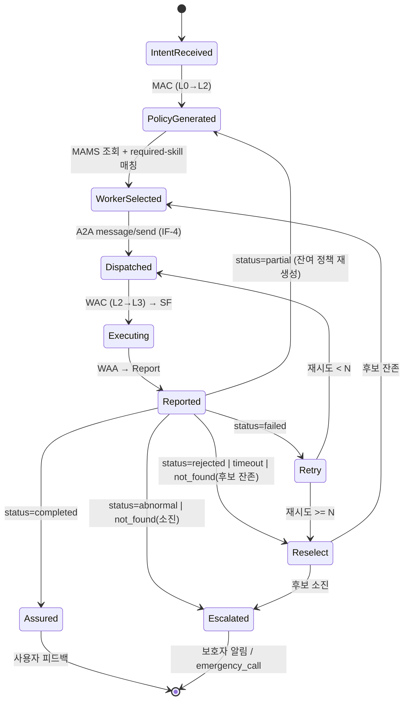
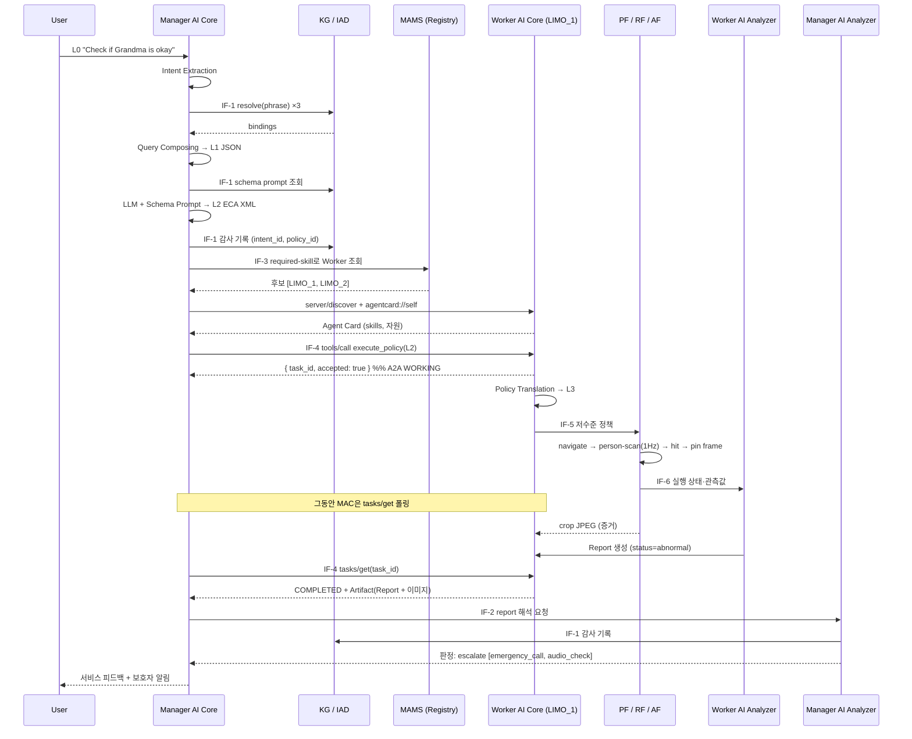

# AI-Care Edge System — 통합 아키텍처 스펙 v0.2

> **문서 위상**: 프로토타입 구현 · IITP 표준화 과제 제안서 · 매거진 논문 세 산출물이 공유하는 **단일 기준 문서(Single Source of Truth)**.
> 세 산출물에서 용어·컴포넌트·스키마가 어긋나지 않도록, 여기서 정한 명칭과 스키마를 그대로 인용한다.
>
> **작성일**: 2026-08-06 · **상태**: Draft (검토 필요) · **상위 과제**: IITP RS-2024-00398199
> **적용 범위**: AI LivingCare Framework의 Manager AI Agent ↔ Worker AI Agent 구간 전체

**변경 이력**

| 버전 | 변경 |
|---|---|
| v0.1 | 최초 작성 (문서 자료 기반) |
| **v0.2** | **`-Ai-living-care` 실제 코드 반영.** ① P-3에 "장애물 차단 시 대체 경로 선택"을 세 번째 LLM 개입 지점으로 추가 ② §10.1 자산 매핑 전면 재작성 — `limo-MCP`를 기준 코드베이스로 확정(U-11 해소) ③ §10.2 시뮬레이션 환경 절 신설 ④ 코드에서 확인된 **크리티컬 갭 6건** 추가(§10.3) ⑤ Phase 0 선결 조건 갱신 — 작업 0-0(small_house 카메라 재검증) 신설, RTF·프레임 pinning이 새 병목 ⑥ 검증 데이터를 논문 Case Study 재료로 편입(단서 포함) ⑦ ROS2 버전 통일 이슈(U-12), 수직 FOV(U-13), RTF(U-14) 추가 |
| **v0.2 검증 이력** | 초안 작성 후 코드 대조 검증을 별도로 수행해 **자체 오류 5건 정정**: 순찰 좌표에 방 이름을 임의 부여한 것, end-to-end 검증 월드를 small_house로 오인한 것, 카메라 rate를 단일 수치로 단정한 것, 기하 시뮬 결과를 "실측"으로 표기한 것, MCP SDK 최신 여부를 반대로 추론한 것 |

---

## 0. 근거 자료와 이 문서가 결정한 것

### 0.1 입력 자료

| 자료 | 이 문서에 반영된 내용 |
|---|---|
| `UKC2026_AI_Agent_Framework_v1_0.pdf` (Jeong & Ahn, SKKU) | 프레임워크 정의, Manager/Worker 역할, SF(Perception/Reasoning/Action) 구조 |
| `Slides-UKC2026-...v3.pptx` slide 16–18 | **아키텍처 정본** — 컴포넌트 배치와 8종 인터페이스 명칭 |
| 동 slide 21 | **파이프라인 정본** — Intent → Policy → 실행 → Report 전 구간 |
| 동 slide 19 | 시나리오 1의 5단계 요약 (①~⑤) |
| 동 slide 20 | 시나리오 1 액션 시퀀스 (①~⑨ 메시지 흐름) |
| 동 slide 22–35 | I2ICF/IETF-126 해커톤 구현 실적 (표준화 트랙 근거) |
| `AI-Care_A2A_Core_Context(2).md` | A2A 개념 매핑, 컴포넌트 목록, 확정/미확정 사항 |
| `AICare Edge System 큰그림 및 시나리오1 진행상황.docx` | Worker 구현 현황, `reasoning.py` 실코드, 7단계 실행 트레이스 |
| `RCP_MCP_NOTES.md` | 기존 MCP 구현 결정(JSON-RPC 2.0 + stdio), RCP 논문 대비 |
| `SESSION_HANDOFF.md` | ROS2 Jazzy/Nav2/Gazebo 검증 상태, 알려진 함정 |
| `I2ICF_ViLaR_IMO_LLM_CONTEXT_KR.md` | I2ICF 연계 구조, 인터페이스/스키마 선례 |
| MCP Specification **2026-07-28** (신규 조사) | A2A-over-MCP 바인딩의 기술적 근거 (§6) |
| A2A Specification **v1.0** / Linux Foundation (신규 조사) | TaskState, AgentCard, 3종 바인딩 |
| **`-Ai-living-care/` 저장소 (v0.2에서 추가)** | **현행 Worker 구현 실체** — 아래 3종 |
| ├ `limo-MCP/` (`MCP_server.py`, `Worker_functions/{Actions,Reasonings,Perceptions}.py`, `Simulation/`) | Worker AI Core·SF의 실제 코드, MCP tool 표면, Gazebo+Nav2 브링업 (§10.1~10.3) |
| ├ `limo-MCP/SESSION_HANDOFF.md` (2026-08-06) | limo_slam과의 분리 결정, cmd_vel 타입 버그, YOLO 연동 검증 기록 |
| └ `limo-patrol-viz/` (`patrol_viz.py`, `patrol_sim.py`, `maps/`) | 순찰 로직 경량 검증 도구 + **커버리지 시뮬 결과** (§10.1, §11.3) |

### 0.2 이 문서가 내린 주요 결정 (요약)

| # | 결정 | 근거 |
|---|---|---|
| D-1 | 컴포넌트 명칭은 **slide 16의 도해를 정본**으로 하고 slide 21의 `Edge AI Analyzer`/`Edge AI's Mgmt System`은 `Manager AI Analyzer`/`Manager AI Management System`으로 정정 | slide 16이 유일한 전체 구조도. 단 **slide 16·17·18은 서로, 그리고 각 슬라이드 내부에서도 명칭이 어긋난다** — 실태는 §2.4 |
| D-2 | **Knowledge Graph(KG)** 와 **Intent Audit Database(IAD)** 를 **분리된 두 저장소**로 정의 | slide 16·21은 IAD만, slide 17과 UKC 논문 Fig.1은 KG만 그린다. 두 기능이 한 박스에 뭉뚱그려져 있으며 접근 패턴이 다르다 (§2.3) |
| D-3 | Intent→실행을 **5계층 Policy Continuum(L0~L4)** 으로 형식화 | I2NSF의 high/low-level policy 2계층을 AI agent 환경으로 확장 (§4) |
| D-4 | A2A를 **MCP 2026-07-28 위에 바인딩**하는 프로파일로 실현 | 사용자 지시 + MCP tasks 확장이 A2A Task와 구조적으로 일치 (§6) |
| D-5 | Worker 확장을 **Phase 0(단일) → 2(다중 병렬) → 3(W↔W)** 3단계로 분리 | A2A 문서의 "첫 PoC = Manager 1 + Worker 1 + Skill 1" 방침 유지하되 최종 goal 명시 (§10) |
| D-6 | KG는 **JSON/YAML 룩업 테이블로 간소 구현**하되 Database Interface 계약을 고정해 후일 그래프DB로 무중단 교체 | 사용자 지시 (§3.1, §4.2) |
| **D-7** *(v0.2)* | **`limo-MCP`를 Worker 기준 코드베이스로 확정.** `limo_slam`은 코드 재사용 없이 참조만 (원 자료는 limo_slam을 "레거시"가 아니라 **별개의 대등한 프로젝트**로 서술하며, 그쪽 Gazebo/Nav2 브링업도 검증돼 있다 — 격하는 이 스펙의 편집 결정) | `limo-MCP/SESSION_HANDOFF.md` 2026-08-06: "limo_slam과는 **별개의 독립 프로젝트**로 진행하기로 함… Gazebo 시뮬레이션 환경도 limo_slam 것을 재사용하지 않고 새로 구성". limo-MCP는 카메라·YOLO·Nav2 end-to-end가 실제로 검증됨 (§10.1) |
| **D-8** *(v0.2)* | **시뮬레이션 로봇은 turtlebot3 waffle, 월드는 AWS RoboMaker small_house** 유지. LIMO 모델 교체는 Phase 1 이후 | 카메라 센서·브리지가 이미 완성돼 있고 SF 코드는 로봇 비의존. 월드가 실제 주거 공간이라 리빙케어 시나리오에 적합 (§10.2) |
| **D-9** *(SOT)* | A2A 종단점을 **최상위가 아니라 각 에이전트 안에** 둔다 — `manager_ai_agent/mcp_client/`, `worker_ai_agent/mcp_server/` | `AI-Care_A2A_Core_Context` §4가 A2A Client를 Manager AI Agent에, A2A Server·Agent Executor를 Worker AI Agent에 배정. §10.1도 `MCP_server.py`를 WAC/A2A 종단점으로 매핑. **최상위 `a2a/`는 근거 없음** |
| **D-10** *(SOT)* | `interfaces/`를 **1급 디렉터리**로 두고 IF-1~IF-8에 각각 디렉터리를 준다 | §3 *"각 인터페이스가 곧 표준화 문서의 한 절이 된다"*. 표준화 항목 S-6의 실체 |
| **D-11** *(SOT)* | PF/RF/AF 디렉터리에서 `_function` 접미사를 뺀다 (`perception/` 등) | 명명 규칙 N-1의 명시적 예외. 상위 `worker_ai_agent/`가 문맥을 준다 |
| **D-12** *(SOT)* | `service_functions/` 중간 계층을 **두지 않는다** | §2.2에서 "Service Functions"는 컴포넌트가 아니라 **행 레이블**. 실제 컴포넌트는 PF/RF/AF 셋 |
| **D-13** *(SOT)* | 컴포넌트 디렉터리에 정식 명칭 전체를 쓴다 (`manager_ai_core`, `core` 아님) | 파일 하나만 열려 있어도 소속이 드러나야 하고, 축약형은 Manager/Worker 양쪽에서 충돌한다 |
| **D-15** *(SOT)* | 배치 규칙 `SP-*` · 감사 규칙 `AR-*` · 하네스 로컬 체크 `H*-` 로 접두를 분리한다 | 같은 접두가 여러 네임스페이스에 있으면 "P-4를 지켰나"의 의미가 결정되지 않는다 |
| **D-16** *(SOT)* | `SOT.md` §2 트리 · `sot_audit.py` 검사 대상 · 실제 디렉터리는 항상 집합 일치 | 셋 중 하나만 고치면 정본이 파생물보다 낡는다 |
| **D-17** *(SOT)* | D-14의 보존 범위는 **구조·파일명·경로**이며 내용 동결이 아니다. 내용 변경은 결정 기록을 조건으로 허용 | 내용까지 얼리면 Phase 0 작업 7건과 안전 결함 수정이 전부 막힌다 (2차 재감사 실증) |
| **D-14** *(SOT)* | `limo-MCP/`·`limo-patrol-viz/`를 **원본 그대로 보존**하고 각각 `worker_ai_agent/`·`tools/` 아래에 통째로 배치한다 | 기존 저장소 작업자가 영향 없이 계속 작업하기 위함. **컴포넌트 디렉터리는 규범을, 구현체는 코드를 갖는다.** 구조·파일명·경로를 얼린다 — 내용 변경은 결정 로그로 남긴다 (D-17) |


> **D-9 ~ D-13은 저장소 구조 정본 `SOT.md`에서 온 결정이다.** 구조 규범과 기계 검사는 `SOT.md` / `sot_audit.py`가 관할한다.

---

## 1. 시스템 개요와 설계 원칙

### 1.1 한 문장 정의

> AI-Care Edge System은 스마트홈 거주자의 **자연어 의도(intent)** 를 기계 판독 가능한 **고수준 정책**으로 번역하고, 이를 A2A로 이기종 IoT **Worker AI Agent**들에 배포하여 각자 독립 실행·보고하게 하며, 그 보고를 해석해 재시도·전환·에스컬레이션을 결정하는 **의도 기반 폐루프(intent-driven closed loop) 리빙케어 프레임워크**이다.

### 1.2 설계 원칙 (P-1 ~ P-6)

- **P-1 대칭성(Symmetry)** — Manager와 Worker는 동일한 3원 구조(`Core` + `Analyzer` + `Management System`)를 가진다. 계층이 늘어나도(Manager → Worker → Sub-Worker) 같은 패턴이 재귀적으로 적용된다.
- **P-2 정책 계층 분리(Policy Layering)** — 각 계층은 바로 아래 계층만 안다. Manager는 디바이스 API를 모르고, Worker는 사용자의 자연어를 모른다. 계층 간 계약은 스키마로만 이뤄진다.
- **P-3 판단 위치 최소화(Minimal Reasoning Surface)** — LLM/VLM 추론은 **의도 해석 시점**, **최종 상태 판정 시점**, 그리고 **비정상 상황(장애물에 경로가 차단된 상황)에서의 대체 경로 선택 시점**에만 개입한다. 그 외 구간은 결정론적 코드가 수행한다. (docx의 "LLM 판단 ① / 코드 자율 구간 / LLM 판단 ②" 3분할을 원칙으로 승격하고, ViLaR-IMO의 VLM 대체 경로 선택을 세 번째 개입 지점으로 추가)
- **P-4 실패 안전(Fail-Safe)** — 유효한 정책·경로·응답이 없으면 정지 상태를 유지한다. (ViLaR-IMO의 "VLM 요청 전에 정지, 유효 route 없으면 정지 유지" 원칙 승계)
- **P-5 감사 가능성(Auditability)** — L0~L4 전 계층의 변환 결과와 모든 A2A 메시지는 `intent_id`로 상관되어 IAD에 기록된다. end-to-end 블랙박스 정책 대비 이 프레임워크의 핵심 장점.
- **P-6 전송 독립성(Transport Agnosticism)** — A2A 의미론은 고정하고 전송(stdio / Streamable HTTP)은 배치에 따라 선택한다. 엣지 로컬 Worker는 stdio, 원격 Worker는 HTTP.

---

## 2. 정규화된 컴포넌트 (Normative Terminology)

**이 절의 명칭을 코드·제안서·논문에서 그대로 사용한다.** 원본 자료의 이표기는 §부록 B에 대조표로 남긴다.

### 2.1 Manager AI Agent

| 컴포넌트 | 정식 명칭 | 약칭 | 책임 |
|---|---|---|---|
| Core | **Manager AI Core** | MAC | Intent Translator + Session Key Manager. L0→L1→L2 변환의 주체 |
| Analyzer | **Manager AI Analyzer** | MAA | Worker report 해석, 임무 완료 판정, 재시도/Worker 전환 결정 |
| Mgmt System | **Manager AI Management System** | MAMS | Worker 등록·상태·수명주기 관리. **Agent Registry 역할 겸함** |
| 지식 저장소 | **Knowledge Graph** | KG | 사용자·공간·디바이스의 관계와 능력 (누가 무엇을 할 수 있는가) |
| 감사 저장소 | **Intent Audit Database** | IAD | intent/policy 이력, 스키마 프롬프트, 검증 규칙. Intent Validator 기능 포함 |

> UKC 논문 Fig.1 **그리고 slide 17의 컴포넌트 표**는 Core를 `Manager Controller`로 표기한다(slide 17의 *그림*은 `Manager AI Core`). **`Manager AI Core`를 정식 명칭으로 하고 `Manager Controller`를 별칭(alias)으로 인정**한다. 논문·슬라이드 개정 시 통일 권장.

### 2.2 Worker AI Agent

| 컴포넌트 | 정식 명칭 | 약칭 | 책임 |
|---|---|---|---|
| Core | **Worker AI Core** | WAC | Policy Translator + Session Key Handler. L2→L3 변환의 주체 |
| Analyzer | **Worker AI Analyzer** | WAA | SF 실행 상태 수집, Worker Report 생성, 자가진단 |
| Mgmt System | **Worker AI Management System** | WAMS | 자기 등록(registration), SF 컨테이너 수명주기 |
| Service Functions | **Perception / Reasoning / Action Function** | PF/RF/AF | 각각 디바이스 데이터 획득 / 판단·해석 / 실제 제어 |

> slide 18의 컴포넌트 표도 Core를 `Worker Controller (Policy Translator)`로, RF를 `Reasoning Function (Rule Based)`로 표기한다(그림은 `Worker AI Core`). 동일하게 별칭 처리한다. **`(Rule Based)` 한정어는 Phase 3에서 RL 기반 선택으로 대체될 예정이므로 정식 명칭에 포함하지 않는다** (§10.4 Phase 3).

> SF는 Kubernetes 컨테이너로 관리 가능(UKC 논문 [3]). Phase 0에서는 단일 프로세스 내 모듈로 구현하고 컨테이너화는 Phase 2 이후.

### 2.3 KG와 IAD를 왜 분리하는가 (D-2 근거)

자료마다 이 자리에 **하나의 박스만** 그려져 있고 그 이름이 서로 다르다.

- slide 16(전체 구조도): `Intent Audit Database (Intent Validator)` — KG 박스 없음
- slide 21(파이프라인): `Intent Audit Database (knowledge base · prompt)` — KG 박스 없음
- slide 17(Manager 상세) 및 UKC 논문 Fig.1: `Knowledge Graph` — IAD 박스 없음

즉 **KG와 IAD가 자료마다 서로를 대체하며 그려지고 있다.** 그러나 slide 17의 표는 KG를 "사용자·공간·디바이스의 관계와 능력을 보유(who can do what)"로, slide 16은 IAD를 "Intent Validator"로 설명한다 — **설명은 명백히 서로 다른 두 기능**이다. 접근 패턴과 수명도 다르므로 **두 저장소로 분리한다.**

| | Knowledge Graph (KG) | Intent Audit Database (IAD) |
|---|---|---|
| 담는 것 | elder는 보통 living_room에 있다 / LIMO_1은 camera·nav 능력 보유 | 2026-08-06 14:03 intent#a1b2 → policy#p7 → LIMO_1 → status=abnormal |
| 접근 시점 | KG Mapping 단계 (읽기 위주) | 전 계층 (쓰기 위주) + 정책 생성 시 스키마/프롬프트 읽기 |
| 갱신 주체 | 관리자/학습 | 시스템 자동 |
| 표준화 관점 | 도메인 데이터 모델 | 감사·보증(assurance) 데이터 모델 |
| 인터페이스 | Database Interface (읽기) | Database Interface (쓰기) + KB audit |

두 저장소 모두 **Database Interface**를 통해 MAC과 MAA가 접근한다 (slide 21의 `KB audit` 화살표가 IAD↔MAA를 잇는 것과 일치).

### 2.4 명칭 불일치의 실태 (대외 자료 수정 필요 항목)

정규화가 필요한 이유를 정확히 기록해둔다. **불일치는 슬라이드 사이뿐 아니라 한 슬라이드 안에서도 발생한다.**

| 불일치 유형 | 구체 사례 |
|---|---|
| **슬라이드 내부 (표 ↔ 그림)** | slide 17: 표는 `Manager Controller` / `Knowledge Graph`, 같은 슬라이드의 그림은 `Manager AI Core` / `Knowledge Graph`. slide 18: 표는 `Worker Controller`, 그림은 `Worker AI Core` |
| **슬라이드 간** | 같은 박스가 slide 16·17에서 `Manager AI Analyzer`, slide 21에서 `Edge AI Analyzer` |
| **저장소 대체** | slide 16·21은 IAD만, slide 17·논문 Fig.1은 KG만 (§2.3) |
| **논문 ↔ 슬라이드** | 논문 Fig.1은 컴포넌트 간 링크를 전부 `A2A Interface` 하나로만 표기. slide 16은 8종으로 구분 (§3) — **논문 쪽이 인터페이스 해상도가 낮다** |
| **단순 오타** | slide 21 제목 `Maganger AI core` |

> **조치**: 이 스펙 확정 후 slide 16/17/18/21과 UKC 논문 Fig.1을 §2.1·§2.2 명칭으로 일괄 정정한다(Phase 0 작업 0-1). 매거진 논문은 처음부터 정규화된 명칭 + 8종 인터페이스로 작성한다.

---

## 3. 인터페이스 카탈로그 (Normative)

slide 16에 이름이 표기된 8종을 정식 인터페이스로 승격한다. **각 인터페이스가 곧 표준화 문서의 한 절(section)이 된다.**

| ID | 명칭 | 종단점 | 전달 내용 | Phase |
|---|---|---|---|---|
| **IF-1** | Database Interface | MAC ↔ KG / IAD, **MAA ↔ IAD** | KG 조회 질의·응답, intent/policy 감사 레코드, KB audit | 0 |
| **IF-2** | Analytics Interface | MAC ↔ MAA (및 WAC ↔ WAA) | 해석된 report, 완료/재시도/전환 판정 | 0 |
| **IF-3** | Registration Interface | MAC ↔ MAMS (및 WAC ↔ WAMS) | Worker 등록·조회·상태 | 0 |
| **IF-4** | **Secure A2A Channel** | MAC ↔ WAC | **L2 고수준 정책, Task 상태, Artifact** | 0 |
| **IF-5** | SF-Facing Interface | WAC → PF/RF/AF | **L3 저수준 정책** | 0 |
| **IF-6** | Agent Monitoring Interface | PF/RF/AF → WAA | SF 실행 상태·관측값 | 0 |
| **IF-7** | AMS-Facing Interface | MAMS ↔ WAMS | Worker 능력·자원·가용성 공시 (Agent Card 갱신) | 2 |
| **IF-8** | Analyzer-Facing Interface | MAA ↔ WAA | 상세 진단·이상 이벤트 (제어 평면과 분리된 관측 평면) | 2 |

### 3.1 IF-1 Database Interface — KG 간소 구현 계약

KG는 Phase 0에서 JSON 파일 룩업으로 구현하되, **인터페이스 계약을 아래로 고정**하여 후일 Neo4j 등으로 무중단 교체한다.

```
resolve(phrase: str, context: dict) -> list[Binding]
  Binding = { element: str, value: any, confidence: float, source: str }
```

간소 구현 KG 데이터 형태 (`kg.json`):

```json
{
  "entities": {
    "grandma":     { "type": "person", "role": "elder", "usual_place": "living_room" },
    "living_room": { "type": "space",  "map_frame": "map", "pose": {"x": 1.2, "y": 0.4, "yaw": 0.0} },
    "LIMO_1":      { "type": "device", "class": "mobile_robot",
                     "skills": ["navigate", "person-scan", "state-check"],
                     "sensors": ["camera", "lidar"], "agent_uri": "stdio://limo_1" },
    "LIMO_2":      { "type": "device", "class": "mobile_robot", "skills": ["navigate", "person-scan"] }
  },
  "phrase_bindings": {
    "grandma": [ {"element": "target", "value": "elder"},
                 {"element": "place",  "value": "living_room"} ],
    "check":   [ {"element": "task",   "value": "safety_check"},
                 {"element": "mobile", "value": ["LIMO_1", "LIMO_2"]} ],
    "is okay": [ {"element": "condition", "value": "realtime"},
                 {"element": "sensor",    "value": "camera"} ]
  }
}
```

> 이 구조는 slide 21의 KG mapping 표(`PHRASE | ELEMENT → RETRIEVED VALUE`)를 그대로 직렬화한 것이다.
> **`phrase_bindings`는 데모용 지름길**이다. Phase 1에서 `entities` 그래프 순회 + 임베딩 유사도 기반 해소로 대체하고, `phrase_bindings`는 회귀 테스트의 정답셋으로 전환한다.

---

## 4. Intent-Policy Continuum (L0 ~ L4)

### 4.1 계층 정의

```
L0  Intent (자연어)           "할머니 괜찮은지 확인해줘"
     │  ← Intent Extraction (MAC)
L1  Intent Query (JSON)        구조화된 의도. 아직 정책 아님
     │  ← KG Mapping + Query Composing (MAC, IF-1)
     │  ← High-level Policy Generation (MAC, LLM + Schema Prompt)
L2  High-level Policy (ECA)    디바이스 비의존. Worker에 배포되는 계약
     │  ← A2A (IF-4)
     │  ← Policy Translation (WAC)
L3  Low-level Policy           디바이스 특화. 파라미터가 구체값으로 확정
     │  ← SF-Facing (IF-5)
L4  Function Call              MCP tool 호출 / ROS2 액션 / 디바이스 API
```

**계층 대응 관계 (표준화 서술용)**

| AI-Care | IETF I2NSF 대응 | 비고 |
|---|---|---|
| L2 High-level Policy | Consumer-Facing Interface의 정책 | 둘 다 device-agnostic ECA |
| L3 Low-level Policy | NSF-Facing Interface의 정책 | AI-Care의 `SF-Facing`은 I2NSF `NSF-Facing`의 직접 대응어 |
| MAC (Intent Translator) | Security Controller | |
| MAMS (Registry) | Developer's Mgmt System / NSF 등록 | |

> **제안서 논거로 쓸 것**: AI-Care는 I2NSF에서 검증된 2계층 정책 분리 구조를 (a) 보안 → 리빙케어 도메인으로, (b) 정적 NSF → 자율 AI Agent로 확장한 것이다. 완전히 새로운 구조가 아니라 **검증된 IETF 아키텍처의 도메인 이식**이라는 점이 표준화 성공 가능성을 높인다.

### 4.2 L1 — Intent Query 스키마

slide 21의 composed JSON을 정규화한다.

```json
{
  "intent_id": "int-20260806-a1b2c3",
  "raw_utterance": "Check if Grandma is okay",
  "issued_by": "user:resident_01",
  "issued_at": "2026-08-06T14:03:11+09:00",
  "target":    "elder",
  "task":      "safety_check",
  "condition": "realtime",
  "place":     "living_room",
  "devices":   ["LIMO_1", "LIMO_2"],
  "sensors":   ["camera"],
  "bindings": [
    {"phrase": "Grandma", "element": "target", "value": "elder",        "confidence": 0.95},
    {"phrase": "Grandma", "element": "place",  "value": "living_room",  "confidence": 0.80}
  ]
}
```

slide 21 원본은 `{intent, target, task, condition, place, devices}` 6개 필드다. `intent_id` · `raw_utterance` · `issued_by` · `issued_at` · `sensors` · `bindings` 는 이 스펙이 추가했다.

특히 **`bindings`** 는 **P-5(감사 가능성)** 를 위해 필수로 둔다 — 어느 어구가 어떤 값으로 해소됐는지 남지 않으면 오역 디버깅이 불가능하다. `sensors`는 slide 21의 KG 매핑표에 `Sensor = Camera`가 있으나 composed JSON에는 누락된 것을 복원한 것이다.

### 4.3 L2 — High-level Policy (ECA XML)

**slide 21 원본 (verbatim — 닫는 태그 없음):**

```text
<living-care-policy>
 <policy-name>SafetyCheck
 <rule-name>check-elder-safety
  <event>safety_check
  <condition>elder, living_room
  <action>inspect-and-report
</living-care-policy>
```

**정규화안 (v0.1):**

```xml
<living-care-policy xmlns="urn:skku:params:xml:ns:yang:ai-care-policy">
  <policy-id>pol-20260806-p7</policy-id>
  <intent-id>int-20260806-a1b2c3</intent-id>
  <policy-name>SafetyCheck</policy-name>
  <issued-by>manager-ai-core-01</issued-by>
  <issued-at>2026-08-06T14:03:12+09:00</issued-at>

  <rule>
    <rule-name>check-elder-safety</rule-name>
    <event>
      <event-type>safety_check</event-type>
      <trigger>on-demand</trigger>
    </event>
    <condition>
      <target-role>elder</target-role>
      <place>living_room</place>
      <modality>realtime</modality>
    </condition>
    <action>
      <action-type>inspect-and-report</action-type>
      <required-skill>person-scan</required-skill>
      <required-skill>state-check</required-skill>
    </action>
  </rule>

  <assurance>
    <deadline-sec>120</deadline-sec>
    <report-mode>on-completion</report-mode>
    <escalation-on>abnormal not_found timeout</escalation-on>
  </assurance>
</living-care-policy>
```

**원본 대비 변경점과 이유**

| 변경 | 이유 |
|---|---|
| `<condition>elder, living_room</condition>` → 구조화 자식 요소 | 콤마 구분 문자열은 파싱 규칙이 정의되지 않아 YANG 모델화 불가 |
| `policy-id` / `intent-id` 추가 | P-5. Report와 상관(correlate)하려면 필수 |
| `<required-skill>` 추가 | **Manager가 Worker를 고르는 유일한 기준**. §7의 fan-out이 이 필드로 동작 |
| `<assurance>` 블록 추가 | docx의 열린 질문(not_found 후속 액션 미정)을 정책 자체에 선언적으로 해결 |
| **디바이스 이름(`LIMO_1`)을 넣지 않음** | **중요.** L2는 device-agnostic이어야 한다(P-2). 어느 Worker가 수행할지는 Manager의 배포 결정이지 정책 내용이 아니다. L1의 `devices`는 후보 힌트이고, 확정은 §7.2 |

### 4.4 L3 — Low-level Policy

**slide 21 원본 (verbatim — 닫는 태그 없음, `target-class`와 `rate`가 한 줄):**

```text
<limo-agent-policy>
 <rule-name>check-elder-safety
  <agent-ip>192.168.0.42:8080
  <goal>37.5665, 126.9781
  <target-class>person <rate>10Hz
  <detect>yolov8n.pt
</limo-agent-policy>
```

> 원본은 XML 형태를 흉내낸 **표현용 의사코드**이며 well-formed XML이 아니다. 논문·제안서에 인용할 때는 아래 정규화안을 쓰고, 슬라이드도 정규화안으로 교체할 것.

**정규화안:**

```xml
<limo-agent-policy xmlns="urn:skku:params:xml:ns:yang:ai-care-limo-policy">
  <policy-id>pol-20260806-p7</policy-id>
  <task-id>task-9f31</task-id>
  <rule-name>check-elder-safety</rule-name>

  <navigation>
    <frame>map</frame>
    <!-- waypoint 요소는 Actions.py의 _goal_xy_yaw()가 받는 dict와 1:1 대응한다:
         {"x","y","frame"?,"yaw_deg"?}. yaw_deg 생략 시 이전→현재 방향으로 자동 계산.
         단 첫 waypoint는 prev_xy가 없어 0.0으로 떨어진다(Actions.py:28) — 현재 로봇
         자세를 읽지 않으므로 필요하면 명시할 것.
         location-label은 KG가 부여해야 하나 아직 매핑이 없다(G-6) — 아래 주의 참조. -->
    <waypoint><x>8.10</x><y>1.71</y><location-label>dining_area</location-label></waypoint>
    <waypoint><x>4.30</x><y>-0.55</y></waypoint>
    <waypoint><x>1.45</x><y>4.35</y></waypoint>
    <waypoint><x>-2.00</x><y>-0.80</y></waypoint>
    <waypoint><x>-7.77</x><y>0.56</y><location-label>upper_left_room</location-label></waypoint>
    <look-around-at-each>true</look-around-at-each>
  </navigation>

  <perception>
    <target-class>person</target-class>
    <model>yolov8n.pt</model>
    <rate-hz>1.0</rate-hz>
    <min-confidence>0.5</min-confidence>
  </perception>

  <reasoning>
    <stop-on-hit>true</stop-on-hit>
    <evidence>crop-jpeg</evidence>
    <evidence-max-px>512</evidence-max-px>
  </reasoning>

  <report>
    <on>completion</on>
    <timeout-sec>30</timeout-sec>
  </report>
</limo-agent-policy>
```

**⚠️ 원본의 오류 2건 (수정 필요)**

1. **`<goal>37.5665, 126.9781</goal>` 은 WGS84 위경도(서울시청)** 다. 실내 LIMO는 Nav2 `map` 프레임 좌표계로 동작하므로 GPS 좌표를 목표로 줄 수 없다. → `frame` + `x/y/yaw` 또는 `location-label`(KG가 좌표로 해소)로 교체. **슬라이드도 수정 권장.**
2. **`<rate>10Hz` vs 실제 구현 1Hz** — docx의 `PersonScan`은 `hz: float = 1.0` 기본값이고 본문도 "YOLO 1Hz 사람 탐지"라고 명시한다. 반면 slide 23의 I2ICF는 "detects an object at **10 Hz**"인데 이는 **주행 중 장애물 회피**라 타당하다. 리빙케어 순찰 탐색은 1Hz가 맞다. → **두 수치는 서로 다른 시나리오의 값이므로, 논문·제안서에서 반드시 시나리오를 명시해 구분**할 것. slide 21의 10Hz는 순찰 시나리오에 잘못 붙은 값으로 보인다.

추가로 `<agent-ip>`는 제거했다. 주소는 정책 내용이 아니라 **A2A 전송 계층의 관심사**이며 Agent Card(§6.2)에 이미 있다.

**v0.2 정합성 메모**

- 위 좌표는 `limo-patrol-viz`가 AWS small_house 맵에서 산출한 순찰 좌표 7개 중 발췌다(§10.1 ⓑ).
- 단일 목표가 아니라 **waypoint 리스트**로 바꾼 이유는 실제 `ActionModule.send_goal_sequence`가 리스트를 받기 때문이며, `MCP_server.py`의 `plan_and_navigate`(단일 목표)가 아니라 **`navigate_waypoints`(리스트)가 순찰 시나리오의 진입점**이다.
- `<look-around-at-each>`는 아직 구현이 없다(§10.3 G-4).

> **⚠️ `location-label`에 관한 주의** — 저장소에서 좌표에 **의미 있는 이름이 붙은 것은 두 개뿐**이다: `(8.10, 1.71)`="식탁 구역", `(-7.77, 0.56)`="좌상단 방" (`limo-patrol-viz/README.md`, `patrol_sim.py`). 나머지 5개 좌표에는 방 이름이 부여된 바 없으므로 위 예시에서도 비워 뒀다.
>
> 한편 부록 A는 `living_room = map(1.2, 0.4)`를 쓰는데 이는 **docx의 `locations.json`에서 온 값이며 위 small_house 좌표계와 무관한 별개 출처**다. 두 좌표계를 섞어 쓰면 안 된다.
>
> **좌표 ↔ 방 이름 매핑을 만드는 것이 곧 G-6(장소 룩업 부재) 해소이자 `kg.json`의 `entities.<space>` 채우기**다(작업 0-10). 그 전까지 논문·제안서에 방 이름이 붙은 좌표를 쓰지 말 것.

---

## 5. Worker Report와 Intent Assurance 루프

### 5.1 Report 스키마 (Normative)

slide 21 원본 `{ found, room, posture, motion: none/12s, confidence, status, request }` 7개 필드를 모두 보존하되, 비구조 표현(`none/12s`)을 해소하고 상관·감사에 필요한 필드를 추가한다.

**출처 표시** — ⟨원⟩ = slide 21 원본, ⟨docx⟩ = docx 실행 트레이스에서 확인, ⟨신규⟩ = 이 스펙이 추가(P-5 감사 가능성 충족 목적, 구현 시 필요성 재검토 대상):

| 필드 | 출처 |
|---|---|
| `status`, `confidence`, `request[]`, `observation.{found, posture, motion}` | ⟨원⟩ |
| `observation.place` | ⟨원⟩ `room` → **`place`로 개명** (L1/L2의 `place`와 용어 통일) |
| `observation.{frame_id, pose}`, `evidence.type/ref` | ⟨docx⟩ (`f_47`, pose, 크롭 JPEG) |
| `report_id`, `task_id`, `policy_id`, `intent_id`, `agent_id`, `reported_at` | ⟨신규⟩ 상관·감사용 |
| `evidence.bbox`, `diagnostics.*` | ⟨신규⟩ 값은 예시이며 근거 자료 없음 |


```json
{
  "report_id":  "rep-20260806-r3",
  "task_id":    "task-9f31",
  "policy_id":  "pol-20260806-p7",
  "intent_id":  "int-20260806-a1b2c3",
  "agent_id":   "LIMO_1",
  "reported_at": "2026-08-06T14:05:47+09:00",

  "status": "abnormal",
  "observation": {
    "found": true,
    "place": "living_room",
    "posture": "lying",
    "motion": { "state": "none", "duration_sec": 12 },
    "frame_id": "f_47",
    "pose": { "x": 1.2, "y": 0.4, "yaw": 0.0 }
  },
  "confidence": 0.86,
  "evidence": { "type": "image/jpeg", "ref": "iad://evidence/f_47", "bbox": [212,64,398,502] },
  "request": ["emergency_call", "audio_check"],
  "diagnostics": { "elapsed_sec": 155, "rooms_visited": ["living_room"], "sf_errors": [] }
}
```

### 5.2 `status` 열거값 (Normative)

| status | 의미 | MAA의 기본 처리 |
|---|---|---|
| `completed` | 정상 수행, 이상 없음 | 사용자에게 정상 피드백 |
| `abnormal` | 수행 성공, **관측 결과가 이상** | `request[]` 에스컬레이션 실행 |
| `not_found` | 수행했으나 대상 미발견 | **다른 Worker로 전환** 또는 탐색 범위 확대 → 소진 시 에스컬레이션 |
| `failed` | 수행 실패 (SF 오류, 하드웨어) | 재시도 → 임계 초과 시 다른 Worker |
| `partial` | 일부만 수행 (예: 4개 방 중 2개) | 잔여분에 대해 후속 정책 발행 |
| `rejected` | Worker가 정책 수락 거부 (능력 불일치, 자원 부족) | 즉시 다른 Worker 재선택 |
| `timeout` | `assurance/deadline-sec` 초과, report 없음 | **Task cancel 후 재선택**. 같은 Worker 재시도는 하지 않는다 — 응답이 없다는 것은 그 Worker가 살아 있다는 근거가 없다는 뜻이다 |

> **`not_found` 는 docx의 열린 질문을 닫는 값이다.** "4곳을 모두 확인해도 못 찾은 경우의 후속 액션 미정" → `status: not_found` + `request: [caregiver_notify]` 로 `abnormal`과 동일한 에스컬레이션 경로를 탄다.

### 5.3 폐루프 (Intent Assurance Loop)



MAA는 이 상태기계의 전이 함수다. 모든 전이는 IAD에 기록된다(P-5).

---

## 6. A2A-over-MCP 바인딩 프로파일 ★핵심 기여

### 6.1 왜 이 바인딩인가 — 그리고 어떤 반론에 답해야 하는가

업계 통념은 **"MCP는 agent↔tool, A2A는 agent↔agent"** 로 역할이 갈린다는 것이다 (A2A 진영 공식 입장). 이 프로젝트는 **A2A의 의미론(semantics)을 유지하면서 전송·직렬화는 MCP를 재사용**한다. 근거:

1. **엣지 로컬성** — Manager와 Worker가 같은 홈 게이트웨이/엣지에 있는 배치가 다수다. stdio 로컬 IPC는 HTTP 왕복 대비 지연·전력에서 유리하며, 이미 팀이 검증한 결정이다(`RCP_MCP_NOTES.md` §1.4-4).
2. **툴체인 단일화** — Worker 내부 SF 호출(L4)이 이미 MCP tool call이다. 외부 A2A까지 MCP로 통일하면 Worker는 **하나의 서버 구현**만 가진다. A2A 서버 + MCP 서버를 이중으로 운영할 필요가 없다.
3. **2026-07-28 MCP 개정이 격차를 없앰** — 아래 §6.2가 보이듯 A2A의 핵심 객체 전부가 현행 MCP에 대응물을 갖게 됐다.

> **논문·제안서에서의 포지셔닝**: "A2A를 MCP로 대체한다"가 아니라 **"A2A 의미론의 MCP 전송 바인딩(binding profile)을 정의한다"** 로 서술할 것. A2A 명세 자체가 JSON-RPC / gRPC / HTTP+JSON 3종 바인딩을 이미 인정하므로, **제4의 바인딩을 제안하는 형태**가 표준화 트랙에서 가장 방어 가능하다.

### 6.2 객체 매핑표 (Normative)

| A2A v1.0 | MCP 2026-07-28 대응 | 구현 메모 |
|---|---|---|
| **AgentCard** (identity·capabilities·skills·endpoint·auth) | `server/discover` 결과 + MCP resource `agentcard://self` | 2026-07-28에서 `server/discover`가 **필수 RPC로 신설**되어 정체성·능력 공시 자리가 생겼다. 확장 필드는 `_meta` 또는 전용 resource로 |
| **AgentSkill** | `tools/list` 항목 1개 = Skill 1개 | 권장 명명: `skill.<domain>.<verb>` (예: `skill.livingcare.person-scan`) |
| **Message / `message/send`** | `tools/call` | L2 정책은 tool 인자의 `policy` 필드에 구조화 데이터로 |
| **Task + TaskState** | `io.modelcontextprotocol/tasks` **공식 확장** | 2026-07-28에서 tasks가 코어 밖 공식 확장으로 재설계. `tasks/get` **폴링** + `tasks/update`(클라이언트→서버 입력) |
| **`tasks/get`** | `tasks/get` | 이름까지 동일 |
| **`tasks/cancel`** | tasks 확장의 취소 경로 | |
| **Artifact** | tool result의 `content` / `structuredContent` | 이미지 증거는 MCP `ImageContent`로 (docx의 크롭 JPEG 반환과 동일) |
| **`TASK_STATE_INPUT_REQUIRED`** | **MRTR** `InputRequiredResult` (`resultType: "input_required"`) | 2026-07-28 신설. "보호자 승인 필요" 같은 human-in-the-loop에 그대로 대응 |
| **`message/stream` (SSE)** | 요청 범위 `notifications/progress` | 장기 실행 순찰의 진행률 보고 |
| **push notification config** | `subscriptions/listen` | 2026-07-28에서 `resources/subscribe`를 대체 |
| **Agent Registry / discovery** | **MAMS**가 담당 (MCP 밖) | A2A는 Agent Discovery 방식(well-known URI 등)을 제시하나 **레지스트리 데이터 모델과 Worker 선택 로직은 구현자 몫**으로 남긴다. MAMS를 AI-Care 고유 확장으로 정의 (§7.2) |

> **이 표의 MCP 쪽 근거는 전부 MCP 명세 2026-07-28 개정판이다** — `server/discover` 신설(필수 RPC), `initialize`/`notifications/initialized` 핸드셰이크 제거(stateless 전환), tasks의 공식 확장(`io.modelcontextprotocol/tasks`) 이관 및 `tasks/get` 폴링 + `tasks/update` 재설계, MRTR `InputRequiredResult` 도입, `subscriptions/listen`이 `resources/subscribe` 대체. 출처: [MCP Specification 2026-07-28 Key Changes](https://modelcontextprotocol.io/specification/2026-07-28/changelog) (SEP-2575, SEP-2663, SEP-2322, SEP-2567). **제안서·논문 제출 전 해당 개정판이 여전히 최신인지 재확인할 것** (§12 U-1).

### 6.3 TaskState 정렬

A2A v1.0의 상태와 §5.2의 `report.status`를 아래로 정렬한다. **둘은 다른 축이다** — TaskState는 *전송 계층의 작업 수명주기*, report status는 *임무의 의미론적 결과*다.

| A2A TaskState | AI-Care 발생 시점 | 대응 report.status |
|---|---|---|
| `SUBMITTED` | Worker가 정책 수락, 아직 실행 전 (`execute_policy`가 `{task_id, accepted:true}` 반환한 직후) | (미발행) |
| `WORKING` | WAC가 L3 번역 후 SF 실행 중 | (미발행) |
| `INPUT_REQUIRED` | 보호자 승인·추가 정보 필요 | (미발행, MRTR로 처리) |
| `COMPLETED` | 실행 종료 + report 생성 | `completed` / `abnormal` / `not_found` / `partial` |
| `FAILED` | SF 오류로 실행 불가 | `failed` |
| `REJECTED` | 능력 불일치·자원 부족으로 수락 거부 | `rejected` |
| `CANCELED` | Manager가 취소 (deadline 초과 등) | `timeout` |
| `AUTH_REQUIRED` | 세션 키 재협상 필요 | (미발행) |

> **주의**: `COMPLETED` ≠ "정상". A2A Task가 성공적으로 끝나도 관측 결과는 `abnormal`일 수 있다. 이 분리를 코드와 논문 양쪽에서 명확히 유지할 것 — 혼동하면 "할머니가 쓰러졌는데 성공으로 보고" 같은 서술 오류가 난다.

### 6.4 Worker의 MCP 인터페이스 (Phase 0 최소 집합)

```
server/discover                    → 프로토콜 버전, 능력, 정체성 (= Agent Card 코어)
tools/list                         → 공개 Skill 목록
resources/read agentcard://self    → 확장 Agent Card (자원 상태, 배터리, 위치 등)

tools/call  execute_policy         → L2 정책 수락. 즉시 task handle 반환
  args: { policy_xml | policy_json, policy_id, deadline_sec, session_ref }
  result: { task_id, accepted: bool, reject_reason? }

tools/call  get_task_report        → (또는 tasks/get) 상태·최종 Report 조회
  args: { task_id }
  result: { state, report? }

tools/call  cancel_task            → 취소
```

**현행 `MCP_server.py`와의 관계 (v0.2)**

현재 노출된 tool 6종은 **L4(함수 호출) 수준**이다. A2A 종단점이 되려면 그 위에 **L2 정책을 통째로 받는 `execute_policy`** 가 얹혀야 한다. 두 층위는 공존한다 — 아래층은 디버깅·회귀 테스트용으로 남긴다.

| 현행 tool | 계층 | Phase 0 처리 |
|---|---|---|
| `plan_and_navigate`, `navigate_waypoints`, `cancel` | L4 (Action) | 유지. `execute_policy` 내부에서 호출 |
| `get_camera_snapshot`, `detect_objects` | L4 (Perception/Reasoning) | 유지 |
| `get_status` | L4 상태 | `get_task_report`로 승격 (task_id 상관 추가) |
| — | **L2** | **`execute_policy` 신설** ← 0-5 |
| — | L4 | **person-scan 5종 노출** (`start_person_scan`·`wait_for_person`·`check_object_state`·`stop_person_scan`·`get_scan_status`) ← 0-9 (G-3) |

**⚠️ MCP SDK 버전 이슈 (근거 정정)**: `MCP_server.py:21`은 `from mcp.server.mcpserver import Image, MCPServer`를 쓴다. 구 SDK의 `mcp.server.fastmcp.FastMCP`가 아닌 새 이름이지만, **이것만으로 최신 SDK라고 판단할 수 없다.** 반대 증거가 저장소 안에 있다:

- 동작하는 두 클라이언트가 모두 `await session.initialize()`를 호출한다 (`Scenarios/send_goal.py:29`, `capture_and_detect.py:31`). 즉 **설치된 SDK는 2026-07-28이 제거했다는 그 핸드셰이크를 여전히 수행한다.**
- `requirements.txt`는 `mcp[cli]`로 **버전 미고정**이다.
- 이 import는 SESSION_HANDOFF에 따르면 limo_slam의 `limo_mcp_server.py`에서 **그대로 복사한 패턴**이다 — 즉 새 SDK를 의도적으로 채택한 흔적이 아니다.

따라서 **설치된 `mcp` 패키지 버전을 직접 확인해 프로토콜 리비전을 판정**해야 한다(§12 U-1). 2026-07-28을 따르지 않는다면 §6.2의 `server/discover`·tasks 확장을 쓸 수 없고, Agent Card와 Task를 **애플리케이션 레벨 tool로 자체 구현**해야 한다(§6.4 최소 집합의 `get_task_report`가 그 대안 경로다).

### 6.5 Phase 0 시퀀스



---

## 7. 다중 Worker: 정책 분해와 Fan-out/Join (Phase 2)

> 최종 goal. Phase 0에서는 구현하지 않으나 **L2 스키마와 Registry 계약은 지금부터 이 모델을 수용하도록 설계**한다.

### 7.1 정책 분해 모드 (Normative)

L2 정책의 `<action>`이 복수 `<required-skill>`을 가지거나 복수 Worker가 필요할 때, MAC은 **sub-policy**로 분해한다. 각 sub-policy는 독립된 `policy_id`와 `task_id`를 갖고 독립적으로 보고된다.

| 모드 | 의미 | 완료 조건 | 시나리오 예 |
|---|---|---|---|
| **AND-ALL** | 전원 수행 필수 | 모든 sub-report가 `completed` | "집안 전등 다 끄고 문 잠가줘" |
| **OR-RACE** | 하나만 성공하면 됨. **첫 성공 시 나머지 취소** | 최초 `completed`/`abnormal` | **시나리오 1**: `devices: [LIMO_1, LIMO_2]` 중 먼저 찾는 쪽 |
| **OR-FALLBACK** | 순차 시도, 실패 시 다음 | 최초 성공 or 후보 소진 | Worker 자원이 부족해 동시 기동 불가할 때 |
| **SEQUENTIAL** | A의 결과가 B의 입력 | 마지막 단계 완료 | "할머니 찾아서 상태 확인하고, 이상하면 약 디스펜서 열어" |
| **SPLIT** | 공간·대상 분할 | 모든 파티션 완료 | "1층은 LIMO_1, 2층은 LIMO_2가 순찰" |

L2 정책에 선언:

```xml
<action>
  <action-type>inspect-and-report</action-type>
  <required-skill>person-scan</required-skill>
  <dispatch-mode>or-race</dispatch-mode>
  <max-parallel>2</max-parallel>
</action>
```

### 7.2 Worker 선택 알고리즘 (A2A 문서의 미결정 사항 U-4 해소안)

A2A 명세는 Worker를 자동 선택하지 않는다 — **선택 로직은 Manager의 책임**이다. Phase 2 초안:

```
select(policy) →
  1. MAMS 조회: required-skill 전부를 공시한 Worker 집합 C
  2. 필터: 가용(alive) ∧ 자원 충족(배터리/CPU) ∧ 세션 유효
  3. 점수화: score(w) = α·capability_match + β·proximity(place)
                      + γ·availability − δ·recent_failure_rate
  4. dispatch-mode에 따라 상위 1개(or-fallback) 또는 상위 k개(or-race, k ≤ max-parallel)
  5. rejected 수신 시 해당 Worker를 제외하고 재선택
```

**⚠️ A2A 문서가 지적한 한계**: Agent Card만으로는 CPU/Memory/Bandwidth 등 **실시간 자원 상태**를 반영하기 어렵다. → **IF-7(AMS-Facing Interface)** 을 통해 WAMS가 주기적으로 자원 상태를 MAMS에 갱신하는 경로를 둔다. 이것이 IF-7의 존재 이유이며, **A2A 대비 AI-Care의 차별점이자 표준화 항목 후보(S-3)** 다.

### 7.3 Join (report 종합)

```
join(sub_reports, mode) →
  or-race:  최초 도착 non-failed report 채택, 나머지 task cancel
  and-all:  전부 completed → completed
            하나라도 abnormal → abnormal (request[] 합집합)
            하나라도 failed → partial
  sequential: 단계 파이프라인 — A의 report를 B의 입력으로 넘긴다 (§7.1 정의)
            앞 단계가 failed면 뒤 단계를 보내지 않고 partial
  or-fallback: 후보를 순서대로 1개씩 시도, 최초 non-failed 채택
            → 후보 소진 시 failed (재시도 상한은 MAA가 건다)
  split:    파티션 커버리지 계산 → 미커버 영역 있으면 partial
```

MAA가 종합 후 **단일 상위 Report**를 만들어 사용자 피드백을 생성한다.

---

## 8. Worker ↔ Worker 통신 (Phase 3)

최종 goal이나 **가장 큰 미검증 영역**이다. A2A 문서도 "향후 확장"으로 남겼다. 두 모델을 제시하고 Phase 2 종료 시점에 결정한다.

| | **M-1 Mediated (중개형)** | **M-2 Direct (직접형)** |
|---|---|---|
| 경로 | W_A → MAC → W_B | W_A → W_B (MAC은 사전 인가만) |
| 보안 | 세션 키가 Manager에만 집중, 단순 | Manager가 delegation token 발급 필요 |
| 지연 | 왕복 2회 | 왕복 1회 |
| 감사 | 모든 통신이 IAD 경유 (P-5 자동 충족) | Worker가 사후 감사 로그 제출해야 함 |
| A2A 대응 | Manager가 Client, 양 Worker가 Server | W_A가 Client 겸 Server (**듀얼 롤**) |
| 위험 | Manager 단일 장애점·병목 | 순환 위임, 권한 상승, 무한 루프 |

> **권고**: Phase 3 초기는 **M-1로 시작**한다. P-5(감사 가능성)를 무료로 얻고, Worker에 Client 구현을 추가할 필요가 없다. M-2는 지연이 병목으로 실측된 뒤에 도입하고, 그때 **delegation token 데이터 모델이 표준화 항목(S-5)** 이 된다.
>
> 시나리오 예 (SEQUENTIAL + W↔W): LIMO_1이 쓰러진 할머니 발견 → Medication Dispenser에 복약 이력 조회 → Smart TV에 음성 안내 송출. M-1이면 MAC이 3개 sub-policy를 순차 발행하는 것으로 동일 효과를 낸다.

---

## 9. 보안 (Secure A2A Channel)

slide 13이 규정한 것: **mTLS/IPsec + Session Key**, 프로토콜 REST/NETCONF/RESTCONF, 문서 형식 XML/YAML.

| 항목 | Phase 0 | Phase 2+ |
|---|---|---|
| 채널 | stdio (로컬, OS 프로세스 격리에 의존) | mTLS over Streamable HTTP |
| 세션 키 | MAC의 Session Key Manager가 발급, WAC의 Handler가 검증 (인메모리) | rekeying 주기 정책화 (slide 16의 "Session Key Rekeying" 루프) |
| 정책 무결성 | `policy_id` + 서명 필드(미사용) | L2 정책에 서명 첨부, WAC가 검증 후 수락 |
| 인가 | 없음 (단일 Worker) | Skill 단위 권한. `AUTH_REQUIRED` TaskState 활용 |
| 감사 | IAD 전 계층 기록 | 동일 + 무결성 체인 |

> Action Function이 "Session Key Check"를 수행하도록 slide 18에 명시돼 있다 — **키 검증이 Core뿐 아니라 실제 액추에이션 직전에도 한 번 더 일어나는 이중 검증 구조**다. 이 설계는 유지할 것 (표준화 항목 **S-7**의 근거 — S-4는 A2A-over-MCP 바인딩이다. F-15 정정).

---

## 10. 구현 로드맵과 기존 자산 매핑

### 10.1 기존 자산

> **U-11 해소 (v0.2)**: v0.1에서 "두 코드베이스 중 택일"로 열어뒀던 문제는 코드 확인으로 닫혔다. `limo-MCP/SESSION_HANDOFF.md`(2026-08-06)가 **`limo_slam`과 별개의 독립 프로젝트로 진행**하기로 확정했고, 시뮬레이션 환경도 재구성했다. **`limo-MCP`가 기준이다** (D-7).

#### ⓐ `limo-MCP` — **현행 기준 코드베이스**

| 자산 | 매핑 위치 | 상태 |
|---|---|---|
| `Worker_functions/Actions.py` — `ActionModule` (`send_goal_sequence`, `send_goal`, `cancel_goal`, `cancel_goal_sequence`, `_goal_xy_yaw`) | **Action Function (AF)** | **웨이포인트 1개 경로만 1회 검증됨** (`completed: 1, total: 1`). **다중 웨이포인트 순차 이동·`cancel_goal_sequence`·`cancel`은 실행 기록 없음.** yaw 미지정 시 이전→현재 방향 자동 계산(첫 점은 0.0 고정) |
| `Worker_functions/Reasonings.py` — `ReasoningModule` + `PersonScan` + `yolo_detect` | **Reasoning Function (RF)** | **순수 로직 완성.** ROS2 비의존, 백엔드 생성자 주입(no-op 기본값)으로 로봇 없이 단독 테스트 가능. **설계 품질이 가장 높은 자산** |
| `Worker_functions/Perceptions.py` — `PerceptionModule` | **Perception Function (PF)** | `/camera/image_raw` 구독, 최신 프레임 캐시. `FrameSource` 시그니처 충족. **단 프레임 1장만 보관 — §10.3 G-1** |
| `MCP_server/MCP_server.py` — `LimoGatewayNode` + MCP tool 6종 | **Worker AI Core (WAC) / A2A 종단점** | `plan_and_navigate`, `navigate_waypoints`, `get_status`, `get_camera_snapshot`, `detect_objects`, `cancel`. **stdio 트랜스포트** |
| `Simulation/sim_bringup.launch.py` + `waffle_bridge_fixed.yaml` | **검증 환경** | Gazebo + Nav2 + slam_toolbox. cmd_vel 타입 버그 수정 포함 (§10.2) |
| `Scenarios/send_goal.py`, `capture_and_detect.py` | **Phase 0 Manager 대역(stub)** | MCP 서버를 서브프로세스로 띄우는 CLI 클라이언트. **정책 실행 회귀 테스트 하네스로 승격** |
| `Scenarios/check_obj_state.json` | 시나리오 DSL 원형 | **현재 실행 불가** — 참조 tool 미구현 (§10.3 G-4) |

**end-to-end 검증 실적** (SESSION_HANDOFF 2026-08-06): MCP 클라이언트 → `plan_and_navigate(x=1.0, y=0.0)` → `get_status()` 폴링이 `navigating` → `succeeded` 전이, `/odom`이 `(0,0)` → `(0.764, 0.009)`로 실제 이동. `get_camera_snapshot` JPEG 저장, `detect_objects` 반환 확인(단 `turtlebot3_world`에 COCO 객체가 없어 벽 텍스처를 `tv`로 오탐 — 파이프라인 연결 증거로만 유효). **MCP → Reasoning → Action → Gazebo 로봇 이동까지 전 구간 연결 확인 완료.**

> **⚠️ 이 검증은 `turtlebot3_world`에서 이뤄졌다. 현재 월드인 AWS small_house에서의 재검증은 아직 없다.** 특히 카메라는 small_house 전환 후 **양 경로 모두 막힌 상태로 기록돼 있다** — 헤드리스 오프스크린은 100초 넘게 프레임 0장(`/dev/dri` 부재로 EGL 컨텍스트 미생성 추정), GUI 경로는 `qt.qpa.xcb: could not connect to display :0`로 크래시. 저장소는 이를 **비대화형 세션(WSLg 소켓 접근 불가)의 제약으로 추정하며 "아직 대화형 세션에서 재검증은 못 했음"** 이라고 명시한다(`sim_bringup.launch.py` docstring). **사람이 자기 WSL 터미널에서 대화형으로 돌려 카메라를 재확인하는 것이 Phase 0의 사실상 첫 작업이다** (작업 0-0, §10.4).

#### ⓑ `limo-patrol-viz` — 순찰 로직 경량 검증 도구

| 자산 | 용도 | 상태 |
|---|---|---|
| `patrol_sim.py` (오프라인) / `patrol_viz.py` (RViz2 노드) | **Gazebo·Nav2·YOLO 없이** A* 경로 + 운동학 적분으로 순찰 재현, 카메라 1인칭 뷰 합성 | 동작 |
| `maps/map.pgm` + `map.yaml` (0.05 m/px, origin −10,−10 은 `map.yaml`로 확인. **608×384는 README 기재값**) | AWS small_house 점유격자 | 확정 |
| `limo/limo.urdf` (WeGo `limo_gazebo` ROS1 xacro에서 변환. **링크 수는 README가 11이라 하나 열거는 8개** — 실물 확인 필요) | **실제 LIMO 모델** | Jazzy 파싱 통과. **Gazebo 플러그인 3블록만 Harmonic 문법으로 재작성하면 시뮬 투입 가능** |

**커버리지 결과** — 경로점 7개 · 375초(6.3분) · 스캔 376회 · 주행 50 m · **커버리지 93.6%** · 2 m² 이상 사각지대 0개. (경로점 5개일 때 83.8% → 사각지대 2곳 추가로 93.6%)
순찰 좌표 (map 프레임): `(8.10, 1.71) (4.30,−0.55) (1.45, 4.35) (−2.00,−0.80) (−7.77, 0.56) (−7.90,−2.95) (7.15,−3.30)`, 스폰 `(3.5, 1.0)`.

> **⚠️ 이 수치는 "실측"이 아니라 기하 시뮬레이션 결과다.** 논문·제안서에 쓸 때 반드시 이렇게 표기할 것. 저장소가 스스로 밝힌 미반영 요소: ① 물리(바퀴 미끄러짐·충돌)와 Nav2 실제 재계획 없음 → **실소요는 20~30% 더 걸릴 것** ② **YOLO를 돌리지 않음** — "FOV 안 + 시야 확보 = 발견"으로 처리 ③ `CAM_RANGE=4.0 m`는 **미측정 가정**이며 커버리지가 여기에 가장 민감 ④ 수직 FOV 미반영(U-13).
>
> **이 도구의 존재 이유가 곧 리스크 신호다** — Gazebo RTF가 0.04~0.06이라 6.3분 시나리오가 벽시계 2시간이 된다. 반복 검증이 불가능해 대체 수단을 만든 것. §10.2·U-14 참조.

#### ⓒ 참조 전용 — `limo_slam / mcp_gateway` (별개의 대등한 프로젝트)

분리 확정(D-7). 원 자료는 이쪽 Gazebo/Nav2 브링업도 검증됐다고 기록하므로 "낡은 코드"가 아니라 **이번 스코프에서 재사용하지 않기로 한 병렬 프로젝트**로 이해할 것. **다음은 참고 가치가 있다**: `_goal_token` 기반 stale 콜백 가드, `interrupt()`의 스레드 `join()` 패턴, `patrol`/`dock`/`look_around` 구현, AMCL `TRANSIENT_LOCAL` QoS 함정. §10.3의 G-4·G-5를 해결할 때 이 구현들을 **다시 작성**해야 한다.

#### ⓓ 타 트랙 참조 자산

| 자산 | 매핑 위치 | 비고 |
|---|---|---|
| I2ICF `intent_server.py` (`POST /receive_policy`, YAML) / `k8s_server.py` (`POST /inference`) | **IAD 원형** | 정책 수신·감사 로그 저장 선례 |
| I2ICF Ollama Llama 3.1 8B intent→JSON 번역 | **MAC의 LLM 단계 선례** | IETF-126 Vienna 시연 |
| ViLaR-IMO 안전 상태기계 (`Ready→Driving→StopRequested→WaitingVLM→RouteValidation→SafeStop`) | **P-3 세 번째 개입 지점 · P-4 실패 안전** | §5.3 폐루프의 참조 모델 |

### 10.2 시뮬레이션 환경 (검증 상태)

| 항목 | 현재 | 비고 |
|---|---|---|
| ROS2 | **Jazzy** (WSL2 Ubuntu 24.04) | **팀 내 배포판이 갈려 있음 — 통일 필요 (U-12)** |
| 로봇 | **turtlebot3 waffle** (LIMO 아님) | `intel_realsense_r200` 카메라 + `ros_gz_image image_bridge`가 패키지에 이미 완성돼 있어 선택. SF 코드는 로봇 비의존이라 나중에 LIMO로 교체해도 `Worker_functions/`는 불변 |
| 월드 | **AWS RoboMaker small_house** | 실제 주거 공간 — 리빙케어 시나리오에 적합. 메시 ~55 MB는 저장소 제외, `fetch_meshes.sh`로 취득 |
| 지도 | 608×384, 0.05 m/px, origin (−10, −10) | `limo-patrol-viz/maps/` |
| 측위 | **`slam_toolbox` (`slam:=True`)** — AMCL 아님 | 사전 제작 지도가 없어 실시간 매핑+내비 동시 수행. limo_slam이 겪은 **AMCL 초기 pose TF 레이스를 원천 회피** |
| 카메라 | `/camera/image_raw` — **rate가 자료마다 다름**: 스펙 30 Hz / d3d12 설정 시 640×480 10 Hz(README 주장) / **실측 ~2 Hz·~3.8 Hz**(SESSION_HANDOFF) | **small_house에서는 아직 프레임 확보 자체를 재검증 못 함** (§10.1 경고). 실측치가 낮을수록 G-1(프레임 소실)의 위험은 오히려 줄지만, 순찰 중 놓칠 확률은 커진다 — **0-0에서 실제 rate를 먼저 재라** |
| YOLO | `yolov8n.pt`, ultralytics 설치 완료 | **numpy를 1.26.4로 고정**해야 함 (apt matplotlib ABI 충돌). MCP 서버 시작 시 더미 프레임으로 warm-up (아래 '해결된 함정' 참조) |
| **RTF** | **0.04 ~ 0.06** | **최대 리스크.** headless·무로봇 상태에서도 그렇다. 6.3분 시나리오 = 벽시계 2시간 |

**해결된 함정 (재발 방지 기록)**

- **`cmd_vel` 타입 불일치** — 스톡 `turtlebot3_waffle_bridge.yaml`은 `TwistStamped`, Nav2 `collision_monitor`는 `Twist` 발행 → ROS2가 별개 토픽으로 취급해 아무것도 브리지되지 않고 로봇이 영영 안 움직였다. `waffle_bridge_fixed.yaml`로 `Twist` 통일하여 해결.
- **RViz2 Map 디스플레이 미동작** — `indexed_8bit_image` 셰이더 링크 실패(RViz2 자체 버그). `limo-patrol-viz`는 `OccupancyGrid` 대신 `CUBE_LIST` 마커로 직접 그린다. **Nav2 costmap 시각화도 같은 이유로 실패할 것**.
- **RViz2 ↔ Gazebo 렌더링 요구가 반대** — Gazebo는 `GALLIUM_DRIVER=d3d12`(하드웨어), RViz2는 `LIBGL_ALWAYS_SOFTWARE=1`(소프트웨어)여야 한다.
- **YOLO 첫 다운로드가 MCP stdio 프로토콜을 깬다** — `yolov8n.pt` 취득 진행표시줄이 stdout으로 나가는데 stdio 트랜스포트는 stdout을 JSON-RPC 전용으로 쓴다. `mcp.run()` 이전에 `contextlib.redirect_stdout(sys.stderr)`로 감싸 더미 프레임 warm-up을 돌려 해결. **A2A-over-MCP 서버를 stdio로 운영할 때의 일반 주의사항** — 어떤 라이브러리든 초기화 중 stdout에 쓰면 프로토콜이 깨진다.
- **numpy ABI 충돌** — `ultralytics`가 numpy 2.x를 설치하면 apt matplotlib(numpy 1.x 빌드)과 충돌해 `from ultralytics import YOLO`가 죽는다. `numpy==1.26.4` 고정으로 해결.

### 10.3 코드에서 확인된 갭 (v0.2 신규)

실제 코드를 읽어 확인한 미구현·결함이다. **G-1과 G-2는 시나리오 1의 핵심 경로를 끊는다.**

| ID | 갭 | 위치 | 영향 |
|---|---|---|---|
| **G-1** | **프레임 pinning 부재** — `PerceptionModule`은 최신 프레임 **1장만** 캐시하고, `get_latest_frame(frame_id)`는 요청 id가 최신과 다르면 `None`을 반환한다 | `Perceptions.py:36-43` | **크리티컬.** `PersonScan`이 `f_47`에서 사람을 잡아도, LLM이 `check_object_state(frame_id="f_47")`를 부를 때쯤엔 최신이 `f_53`이라 **증거 이미지를 영영 못 얻는다**. docx가 "미구현·크리티컬"로 적은 항목이 코드로 확증됨 |
| **G-2** | **`pose`가 항상 `None`** — `PerceptionModule._on_image`가 pose를 채우지 않는다 | `Perceptions.py:33` | `PersonScan`의 `hit["pose"]`, Report의 `observation.pose`가 전부 null. **"어느 방에서 발견했는지"를 보고할 수 없다.** TF(`map`←`base_link`) 조회 결선 필요 |
| **G-3** | **person-scan API 5종이 MCP tool로 노출되지 않음** — `start_person_scan` / `wait_for_person` / `check_object_state` / `stop_person_scan` / `get_scan_status`가 `ReasoningModule`에 **구현돼 있으나** `MCP_server.py`에 tool 데코레이터가 없다. 현재 노출된 tool은 `plan_and_navigate`·`navigate_waypoints`·`get_status`·`get_camera_snapshot`·`detect_objects`·`cancel` **6종뿐** | `MCP_server.py:105-173` | 시나리오 1의 탐색·판정 경로를 외부(Manager/LLM)에서 호출할 수 없다. **구현이 아니라 노출만 하면 되는 저비용 작업** |
| **G-4** | **`look_around` / patrol 미구현** — `Scenarios/check_obj_state.json`이 `look_around`·`is_looking_around`·`interrupt_look_around`를 참조하지만 `Actions.py`에 없다 | `Actions.py`, `check_obj_state.json` | 해당 시나리오 파일 **실행 불가**. limo_slam에 구현이 있었으나 분리로 넘어오지 않았다 |
| **G-5** | **stale 콜백 가드 없음** — `_on_result`가 토큰 검사 없이 `self.status`를 덮어쓴다. `cancel_goal`은 Nav2 취소 승인을 안 기다리고 낙관적으로 `cancelled`로 쓴다 | `Actions.py:137-143, 164-167` | 취소 직후 도착한 이전 목표의 결과 콜백이 상태를 오염시킬 수 있다. limo_slam이 `_goal_token`으로 고쳤던 버그의 재발 |
| **G-6** | **장소 룩업(KG 연결점) 부재** — `list_locations` / `locations.json`이 없다. `plan_and_navigate`는 좌표만 받는다 | `MCP_server.py` | L2 정책의 `<location-label>living_room`을 좌표로 해소할 경로가 없다. §3.1 `kg.json`이 이 자리를 채운다 |

**부수 관찰 (심각도 낮음)**

- `plan_and_navigate`의 `start`가 현재 pose가 아니라 `action.last_goal`이다 (`MCP_server.py:108`). 현재 `_plan_fn`이 start를 안 쓰므로 무해하나, 실제 경로계획을 넣으면 버그가 된다.
- `_plan_fn`은 목표 1개를 그대로 리스트로 돌려주는 통과 함수다 (설계 의도 — 실제 전역 계획은 각 `NavigateToPose`가 Nav2 내부에서 수행). **다중 웨이포인트 순찰은 `navigate_waypoints`로 직접 넣어야 한다.**
- MCP SDK import 경로가 `from mcp.server.mcpserver import Image, MCPServer`다 (구 `fastmcp.FastMCP` 아님). 다만 **클라이언트가 `session.initialize()`를 부르고 있어 구 핸드셰이크가 살아 있다** — 근거 정리는 §6.4.
- `check_object_state`는 pin된 프레임을 받아도 **YOLO를 다시 돌린다**(`Reasonings.py:199`). `PersonScan`이 이미 확보한 `hit["bbox"]`를 재사용하지 않으므로, 0-7만으로는 경로가 완전히 닫히지 않는다 — **bbox 전달 경로도 함께 뚫을 것**.
- `check_obj_state.json`은 `check_object_state`에 `detections` 인자를 넘기는데 `ReasoningModule.check_object_state`는 그 인자를 받지 않는다 (`Reasonings.py:193`). G-4와 별개의 두 번째 실행 불가 사유.

### 10.4 Phase 계획

**Phase 0 — 단일 Worker 왕복 (목표: 2~3주)**

| # | 작업 | 산출물 |
|---|---|---|
| **0-0** | **대화형 WSL 터미널에서 small_house 카메라 재검증 + 실제 프레임 rate 측정 + 설치 `mcp` SDK 버전 확인** | **다른 모든 작업의 전제** (§10.1 경고, U-1) |
| 0-1 | 이 스펙 확정 + 용어 정규화를 슬라이드/논문에 반영 | 스펙 v1.0 |
| 0-2 | `kg.json` 작성 + IF-1 `resolve()` 구현 | KG 간소 구현 |
| 0-3 | MAC: Intent Extraction → KG Mapping → Query Composing → LLM 정책 생성 | L0→L2 파이프라인 |
| 0-4 | L2/L3/Report JSON Schema + XSD 작성, 검증기 | 스키마 3종 |
| 0-5 | Worker: `execute_policy` / `get_task_report` / `cancel_task` MCP tool | A2A-over-MCP 최소 서버 |
| 0-6 | WAC Policy Translator (L2→L3) | 번역기 |
| 0-7 | **G-1 프레임 링버퍼 + pinning** — `PerceptionModule`에 N프레임 버퍼와 `pin(frame_id)` 추가 | 증거 이미지 확보 경로 복구 |
| 0-8 | **G-2 pose 결선** — TF(`map`←`base_link`)를 프레임에 스탬프 | Report의 `observation.pose` |
| 0-9 | **G-3 person-scan tool 노출** — `start_person_scan`/`wait_for_person`/`check_object_state`/`stop_person_scan`/`get_scan_status` **5종** MCP tool 추가 | 시나리오 1 호출 경로 |
| 0-10 | **G-6 `list_locations`** — `kg.json` 기반 장소→좌표 해소 tool | L3 `location-label` 해소 |
| 0-11 | **G-4 `look_around`** 구현 (limo_slam 참조해 재작성) | 도착 후 제자리 스캔 |
| 0-12 | **G-5 stale 콜백 가드** — `_goal_token` 도입, `cancel_goal` 승인 대기 | Action 견고화 |
| 0-13 | WAA Report 생성 + MAA 판정 로직 | 폐루프 완성 |
| 0-14 | 시나리오 1 end-to-end 실행 + 로그 (§12 U-14 전략에 따라 `limo-patrol-viz` 우선, Gazebo 최종 확인) | 데모 영상·측정 로그 |

**⚠️ Phase 0 선결 조건 (v0.2 갱신)**

v0.1이 지목한 `ultralytics` 미설치는 **해소됐다**. 카메라는 `turtlebot3_world`에서 검증됐으나 **현재 월드(small_house)에서는 미검증**이므로 완전 해소가 아니다. 새 선결 조건은 세 가지다.

1. **0-0: small_house 카메라 재검증** — 저장소 기록상 비대화형 세션에서 양 경로가 막혔고 대화형 재검증이 안 됐다. **여기서 프레임이 안 나오면 시나리오 1 전체가 성립하지 않으므로 가장 먼저 확인해야 한다.** 동시에 실제 프레임 rate를 재고(§10.2 표의 세 수치 중 무엇이 참인지), 설치된 `mcp` SDK 버전도 확인한다(U-1).
2. **G-1(프레임 pinning)이 0-7에 있는 이유** — 이것이 없으면 "발견 → 증거 이미지 → LLM 판정"이라는 시나리오 1의 **결론 부분이 성립하지 않는다.** 카메라 다음으로 먼저다. 단, pin만으로는 부족하고 `PersonScan`의 bbox 전달 경로도 함께 뚫어야 한다(§10.3 부수 관찰).
3. **RTF 0.04~0.06 대응 전략 확정** (U-14) — Gazebo에서 반복 검증이 불가능하므로 `limo-patrol-viz`로 논리 검증하고 Gazebo는 최종 1회 확인용으로 쓰는 이원화가 현재 유일한 실행 가능한 방식이다. 이 전제를 팀이 합의해야 일정이 성립한다.

**Phase 1 — 견고화·감사** : IAD 구축, 전 계층 감사 기록, 스키마 검증 강제, 시나리오 50개 중 5~10개 확장, 실패 경로(`not_found`/`timeout`) 검증. 추가로 **① `CAM_RANGE` 실측**(YOLO가 사람을 몇 m까지 안정적으로 잡는지 — 커버리지 93.6%가 이 값에 좌우됨) **② 수직 FOV 반영**(U-13) **③ 실제 LIMO 모델 교체**(URDF는 변환 완료, Gazebo 플러그인 3블록만 Harmonic 문법으로 재작성) **④ YOLO 오탐 검증**(small_house 벽 액자 속 인물을 사람으로 잡는지).

**Phase 2 — 다중 Worker** : MAMS Registry, IF-7 자원 갱신, dispatch-mode 5종, fan-out/join, 가상 Worker(Smart TV / Medication Dispenser) 2종 추가, mTLS 전환.

**Phase 3 — W↔W + 학습** : M-1 중개형 W↔W, delegation token(M-2), 시나리오 50개 확장 + LLM 증강 + **Search-R1식 outcome-reward RL로 시나리오 선택 학습**(docx 학습 전략).

> **RL의 위치를 명확히 할 것**: docx의 RL은 *정책 생성*이 아니라 **Worker가 사전 저장된 시나리오 배열 중 정책에 맞는 것을 고르는 선택 문제**다. 즉 **WAC(Policy Translator) 내부의 선택 모듈**이며, L2→L3 번역을 규칙 기반에서 학습 기반으로 대체하는 것이다. 논문에서 이 위치를 흐리면 "정책 생성을 RL로 한다"로 오독된다.

---

## 11. 표준화 항목 도출 (IITP 제안서 입력)

### 11.1 표준화 후보 항목

| ID | 항목 | 내용 | 대응 IETF/TTA 트랙 | 우선순위 |
|---|---|---|---|---|
| **S-1** | **AI-Care High-level Policy Data Model** | L2 ECA 정책의 YANG 모델 (§4.3) | NMRG / I2ICF, I2NSF Consumer-Facing 선례 | ★★★ |
| **S-2** | **AI-Care Low-level Policy Data Model** | L3 디바이스별 정책 YANG + 디바이스 클래스 확장 규칙 (§4.4) | I2NSF NSF-Facing 선례 | ★★★ |
| **S-3** | **Agent Capability & Resource Registration Model** | Agent Card 확장 — 실시간 자원 상태 포함 (IF-7). **A2A의 공백을 메우는 부분** (§7.2) | I2ICF, A2A 확장 | ★★★ |
| **S-4** | **A2A-over-MCP Binding Profile** | §6 전체. A2A 4종 바인딩 중 제4안 제안 | A2A(LF) 기고 + IETF I-D | ★★☆ |
| **S-5** | **Intent Assurance / Worker Report Model** | Report 스키마 + status 열거 + 에스컬레이션 (§5) | NMRG intent-based networking | ★★★ |
| **S-6** | **AI-Care Interface Catalog** | IF-1~IF-8 정의 (§3) — 프레임워크 문서의 골격 | I2ICF framework I-D | ★★☆ |
| **S-7** | **Secure A2A Channel & Session Key Management** | mTLS/IPsec + rekeying + 이중 키 검증 (§9) | I2NSF 보안 모델 선례 | ★☆☆ |

### 11.2 제안서에서 쓸 차별화 논거 3가지

1. **검증된 IETF 아키텍처의 도메인 이식** — I2NSF의 2계층 정책 분리를 리빙케어 AI 에이전트로 확장. 새 구조를 발명하는 것이 아니라 **표준화 이력이 있는 구조를 확장**하므로 채택 가능성이 높다 (§4.1).
2. **A2A/MCP가 남긴 공백을 정확히 지목** — A2A는 Agent Card로 정적 능력만 공시하며 **Worker 선택 로직은 명시적으로 구현자 책임**으로 두고, 레지스트리 데이터 모델도 정의하지 않는다. 또한 Agent Card만으로는 CPU·메모리·대역폭 등 **실시간 자원 상태를 반영하기 어렵다**는 점이 선행 연구(Duan & Lu, arXiv:2508.15819)에서 지적됐다. MCP는 애초에 agent↔agent를 다루지 않는다. **AI-Care의 MAMS + IF-7이 정확히 그 공백을 메운다** (S-3, S-6).
3. **구현 실적 보유** — IETF-126 Vienna I2ICF 해커톤 시연, 오픈소스 공개(`github.com/jaehoonpauljeong/I2ICF`), 데모 영상, 기존 I-D 3건(`draft-jeong-nmrg-ibn-network-management-automation`, `draft-ahn-nmrg-5g-security-i2nsf-framework`, `draft-gu-nmrg-intent-translator`). **문서만 있는 제안이 아니다.**

### 11.3 매거진 논문 구성 초안

| 절 | 내용 | 재료 |
|---|---|---|
| I. Introduction | agentic AI의 등장, 스마트홈 리빙케어 수요, 왜 표준 인터페이스가 필요한가 | slide 4–6(스마트홈 플랫폼·AI 에이전트 유형·멀티모달), slide 15(고령·장애인 대상 명시). **고령화 통계는 자료에 없음 — 별도 인용 필요** |
| II. Background | IBN/I2NSF, MCP, A2A, RCP의 관계 정리 | slide 7(Cisco IBN) · RCP_MCP_NOTES §2–3(RCP) · AI-Care_A2A_Core_Context(A2A) · MCP 2026-07-28 명세. **I2NSF는 자료에 없음 — RFC 8329 등 직접 인용 필요** |
| III. AI-Care Framework | 대칭 Manager/Worker, IF-1~IF-8 | §2, §3 (slide 16 그림) |
| IV. Intent-Policy Continuum | L0~L4, 스키마, I2NSF 대응 | §4 (slide 21 그림) |
| V. A2A-over-MCP Binding | 매핑표, TaskState 정렬 — **논문의 novelty** | §6 |
| VI. Case Study | 시나리오 1 end-to-end + 측정 | **확보된 재료**: ① 순찰 커버리지 93.6% — **기하 시뮬레이션 결과**로 명시할 것(물리·Nav2 재계획·YOLO 미반영, `CAM_RANGE=4 m` 가정) ② MCP→Nav2 이동 검증 `(0,0)`→`(0.764, 0.009)` — **`turtlebot3_world`, 단일 웨이포인트**로 명시 ③ 주거 월드(AWS small_house) 도입. **추가 필요**: small_house 재검증, 다중 웨이포인트, 지연·성공률, REST 기준선 |
| VII. Open Issues | 다중 Worker 확장성, Registry 병목, W↔W 보안 | §7, §8, §12 |
| VIII. Conclusion | | |

> **측정할 것 (Phase 0에서 반드시 로깅)**: intent→policy 생성 지연, A2A 왕복 지연, 정책 번역 지연, 임무 총 소요, 정책 생성 정확도(스키마 검증 통과율), 시나리오 성공률. A2A 문서가 지적한 "A2A가 Custom REST 대비 비용을 늘리는지"를 답하려면 **REST 기준선(baseline)도 함께 측정**해야 한다.

---

## 12. 미결정 사항 (Open Issues)

| ID | 항목 | 영향 | 결정 시점 |
|---|---|---|---|
| **U-1** | MCP SDK 버전 — 구(`initialize` 기반) 유지 vs 2026-07-28 stateless 전환. 제출 직전 명세 최신판 재확인 포함 | Worker 서버 전면 재작성 여부, §6 전체의 근거 | **Phase 0 착수 전 (최우선)** |
| ~~U-11~~ | ~~Worker 코드베이스 기준 선택~~ | — | **✅ 해소 (v0.2)** — `limo-MCP`로 확정 (D-7) |
| **U-7** *(부분 해소)* | `ultralytics` 설치·YOLO 검출은 **✅ 해소**. 그러나 **카메라는 `turtlebot3_world`에서만 검증**됐고 현재 월드(small_house)에서는 프레임 확보 자체가 미검증 | 시나리오 1 전체의 전제 | **작업 0-0 (최우선)** |
| **U-12** | **ROS2 배포판 통일** — 현재 팀 내에서 서로 다른 버전을 사용 중. 코드·문서는 전부 **Jazzy** 기준(`source /opt/ros/jazzy/setup.bash`, `ros-jazzy-*` 패키지명, `sim_bringup.launch.py`, `run_patrol.sh`) | 통일 결과에 따라 **launch 파일·설치 스크립트·README·이 스펙 §10.2를 일괄 수정**해야 함. Gazebo 세대(Harmonic vs Classic)와 `ros_gz` 인터페이스도 함께 바뀜 | **통일 즉시 (사용자 제기)** |
| **U-13** | **수직 FOV 미반영** — 현재 커버리지 계산은 2D 가정이라 4 m 거리의 **바닥에 누운 사람이 화면 아래로 벗어나는 경우**를 못 잡는다 | **쓰러진 상황이 리빙케어에서 가장 위험한 시나리오인데 바로 그 부분이 미검증.** 커버리지 93.6%를 논문에 쓰려면 반드시 선결 | **Phase 1 / 논문 투고 전** |
| **U-14** | **Gazebo RTF 0.04~0.06 대응** — ① 가구 collision을 단순 박스로 교체 ② `<collision>` 제거 ③ `limo-patrol-viz` 이원화 유지 중 택일 | Phase 0 일정 전체. 현재는 ③이 유일한 실행 가능안 | **Phase 0 착수 전** |
| **U-2** | L2 정책 직렬화 — XML(slide 원본) vs JSON | XML은 YANG/NETCONF 정합, JSON은 LLM 생성 정확도·MCP 친화 | Phase 0. **권고: 내부는 JSON, 표준 문서·전시는 XML로 양방향 변환** |
| **U-3** | LLM 선택 — Claude API(기존 Manager) vs Ollama Llama 3.1(I2ICF 선례) vs 로컬 소형 모델 | 엣지 배치 실현성, 논문의 "on-device" 주장 가능 여부 | Phase 0 |
| **U-4** | Worker 선택 점수 함수의 가중치 α,β,γ,δ | Phase 2 | Phase 2 |
| **U-5** | Task 상태 전달 — 폴링 vs `notifications/progress` 스트리밍 | 순찰처럼 긴 작업의 UX | Phase 1 |
| **U-6** | 시나리오 50개의 스키마와 저장 형식 (RL 학습 데이터) | Phase 3 학습 가능 여부. **지금 정해두지 않으면 나중에 전수 재작성** | **Phase 1까지** |
| **U-8** | `<goal>` GPS 좌표 오류의 슬라이드/논문 반영 | 대외 발표 정확성 | 즉시 |
| **U-9** | W↔W 모델 M-1 vs M-2 확정 | Phase 3 | Phase 2 종료 시 |
| **U-10** | 실제 LIMO 하드웨어 투입 시점 (현재 전부 시뮬) | 논문의 실증 강도 | Phase 1 |

---

## 부록 A. 시나리오 1 전 계층 트레이스

| 계층 | 산출물 |
|---|---|
| **L0** | `"할머니 괜찮은지 확인해줘"` |
| **추출** | `["Grandma", "check", "is okay"]` |
| **KG 매핑** | `Grandma → target=elder, place=living_room` / `check → task=safety_check, mobile=[LIMO_1,LIMO_2]` / `is okay → condition=realtime, sensor=camera` |
| **L1** | `{intent_id, target: elder, task: safety_check, condition: realtime, place: living_room, devices: [LIMO_1, LIMO_2], bindings: [...]}` |
| **L2** | `<living-care-policy>` — event=`safety_check`, condition=`{elder, living_room, realtime}`, action=`inspect-and-report`, required-skill=`person-scan, state-check`, dispatch-mode=`or-race`, deadline=120s |
| **A2A** | `tools/call execute_policy(policy, deadline_sec=120)` → `{task_id: "task-9f31", accepted: true}` (TaskState=`WORKING`) |
| **L3** | `<limo-agent-policy>` — goal=`map(1.2, 0.4, 0.0)`, fallback=`bedroom kitchen bathroom`, target-class=`person`, model=`yolov8n.pt`, rate=1Hz, min-conf=0.5, stop-on-hit=true, evidence=crop-jpeg 512px |
| **L4** | `list_locations()` → `navigate_waypoints([...])` → `start_person_scan(hz=1.0)` → `wait_for_person(30)` → **hit(f_47)** → `cancel()` → `look_around()` → `check_object_state(frame_id="f_47")` → crop JPEG |
| **L4 구현 상태** *(v0.2)* | ✅ `navigate_waypoints` · `cancel` · `detect_objects`(내부) — MCP tool로 노출됨<br>⚠️ `start_person_scan` · `wait_for_person` · `check_object_state` — **로직은 있으나 tool 미노출** (G-3)<br>❌ `list_locations`(G-6) · `look_around`(G-4) · **`frame_id="f_47"` 조회 자체가 불가**(G-1) |
| **판정** | LLM이 크롭 이미지 관찰 → `posture=lying, motion=none/12s` |
| **Report** | `status=abnormal, confidence=0.86, request=[emergency_call, audio_check]` (TaskState=`COMPLETED`) |
| **MAA** | 이상 판정 → 에스컬레이션 실행 → IAD 기록 |
| **피드백** | "거실에서 할머니를 발견했으나 12초간 움직임이 없어 보호자에게 알렸습니다." |

## 부록 B. 원본 자료 간 명칭·수치 불일치 대조표

**B-1. 컴포넌트 명칭** (그림=도해의 박스 라벨, 표=슬라이드 내 컴포넌트 표)

| 항목 | slide 16 (그림) | slide 17·18 그림 | slide 17·18 **표** | slide 21 | UKC 논문 Fig.1 | **정본(이 문서)** |
|---|---|---|---|---|---|---|
| Manager 중심 모듈 | Manager AI Core | Manager AI Core | **Manager Controller** | **Maganger AI core** *(오타)* | Manager Controller | **Manager AI Core (MAC)** |
| Manager 분석기 | Manager AI Analyzer | Manager AI Analyzer | Manager Analyzer | **Edge AI Analyzer** | Manager Analyzer | **Manager AI Analyzer (MAA)** |
| Manager 관리시스템 | Manager AI's Mgmt System | Manager AI's Mgmt System | Manager Management System | **Edge AI's Mgmt System** | Manager Mgmt System | **Manager AI Management System (MAMS)** |
| 지식/감사 저장소 | **Intent Audit Database (Intent Validator)** | **Knowledge Graph** (17) | Knowledge Graph | **Intent Audit Database** (knowledge base·prompt) | **Knowledge Graph** | **KG와 IAD 두 저장소로 분리** |
| Worker 중심 모듈 | Worker AI Core | Worker AI Core | **Worker Controller (Policy Translator)** | Policy Translator | Worker Controller | **Worker AI Core (WAC)** |
| Reasoning SF | Reasoning Function | Reasoning Function | **Reasoning Function (Rule Based)** | — | Reasoning Function | **Reasoning Function (RF)** — `(Rule Based)` 한정어 제외 |
| 컴포넌트 간 링크 | **8종으로 명명** | 8종 | — | 일부만 표기 | **전부 "A2A Interface" 하나** | **IF-1 ~ IF-8** (§3) |

> **핵심**: 불일치는 슬라이드 *사이*뿐 아니라 slide 17·18 *내부*(표 ↔ 그림)에서도 발생한다. 논문 Fig.1은 인터페이스를 하나로 뭉뚱그려 slide 16보다 해상도가 낮다.

**B-2. 수치·범위**

| 항목 | 원 자료가 말하는 것 | **정본(이 문서)** |
|---|---|---|
| 탐지 주기 | slide 21 `<rate>10Hz` / slide 23 I2ICF "10 Hz" (주행 중 회피) / docx `hz=1.0`, "YOLO 1Hz 사람 탐지" | **순찰 탐색 1Hz · 주행 회피 10Hz** — 시나리오별 구분 |
| 목표 좌표 | slide 21 `<goal>37.5665, 126.9781` (WGS84, 서울시청) / docx `locations.json`의 `{"x":1.2,"y":0.4,"label":"거실"}` + Nav2 `ComputePathToPose` | **`map` 프레임 x/y/yaw** (실내 로봇에 GPS 좌표는 사용 불가) |
| Manager 구현 범위 | slide/논문: 포함 / docx: **"이해·번역 담당, 우리 스코프 아님… 우리가 직접 구현·학습하는 대상이 아니다"** | **포함** (2026-08-06 사용자 결정, KG는 간소 구현) |
| Worker 수 | slide 16: N개 / slide 21: 1개(도해상) / docx: **"Manager 1개 + Worker N개"** (단 시나리오 1 구현 범위는 1개) | **Phase 0: 1 / Phase 2: N 병렬 / Phase 3: N + W↔W** |
| Worker 코드베이스 | 구 SESSION_HANDOFF: `mcp_gateway/*` / docx: `mcp_server.py`+`reasoning.py`+`store.py` / **실제 저장소: `limo-MCP/`** | **`limo-MCP` 확정** (D-7). docx가 서술한 `store.py`·`locations.json`·`list_locations`는 **실제 코드에 없다** — 계획 단계 서술이었음 (§10.3 G-6) |
| 시뮬 로봇 | slide/논문/docx 전부 **LIMO** 전제 | **현재 turtlebot3 waffle** (D-8). LIMO URDF는 변환 완료·미투입 |

---

## 참고 자료

- Jeong, J. P. and Ahn, Y., "An Artificial-Intelligence Agent Framework for Intelligent Livingcare Services at Smart Home," UKC 2026. (IITP RS-2024-00398199)
- [A2A Protocol Specification v1.0](https://a2a-protocol.org/latest/specification/) — Linux Foundation Agent2Agent Project
- [A2A Agent Discovery](https://a2a-protocol.org/latest/topics/agent-discovery/)
- [MCP Specification 2026-07-28 — Key Changes](https://modelcontextprotocol.io/specification/2026-07-28/changelog)
- [The 2026-07-28 Specification (MCP Blog)](https://blog.modelcontextprotocol.io/posts/2026-07-28/)
- Duan, Q. and Lu, Z., "Agent Communications toward Agentic AI at Edge — A Case Study of the Agent2Agent Protocol," [arXiv:2508.15819](https://arxiv.org/abs/2508.15819)
- Lee, L. and Lau, J., "Robot Context Protocol (RCP): A Runtime-Agnostic Interface for Agent-Aware Robot Control," [arXiv:2506.11650](https://arxiv.org/abs/2506.11650)
- Jin, B. et al., "Search-R1," [arXiv:2503.09516](https://arxiv.org/abs/2503.09516)
- [I2ICF IETF-126 구현](https://github.com/jaehoonpauljeong/I2ICF/tree/main/IETF-126) · [데모 영상](https://www.youtube.com/watch?v=ZKX4iXNa774)
- 본 프로젝트 저장소: `-Ai-living-care/` (`limo-MCP/`, `limo-patrol-viz/`)
- 시뮬레이션 월드: [aws-robotics/aws-robomaker-small-house-world](https://github.com/aws-robotics/aws-robomaker-small-house-world) (Apache-2.0, 아카이브됨)
- LIMO 로봇 기술서: [WeGo-Robotics/limo_gazebo](https://github.com/WeGo-Robotics/limo_gazebo)
- IETF I-D: [ibn-network-management-automation](https://datatracker.ietf.org/doc/draft-jeong-nmrg-ibn-network-management-automation/07/) · [5g-security-i2nsf-framework](https://datatracker.ietf.org/doc/draft-ahn-nmrg-5g-security-i2nsf-framework/02/) · [intent-translator](https://datatracker.ietf.org/doc/draft-gu-nmrg-intent-translator/03/)
